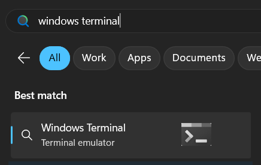
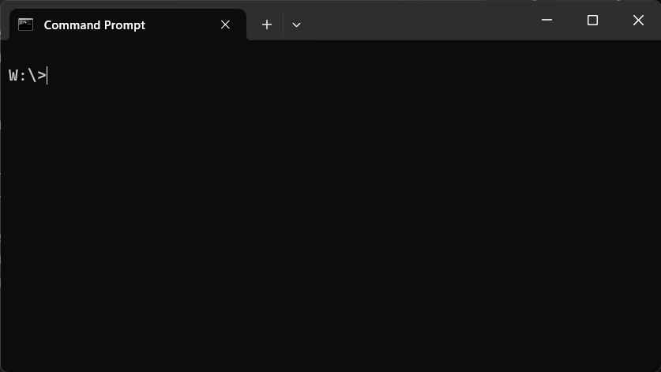
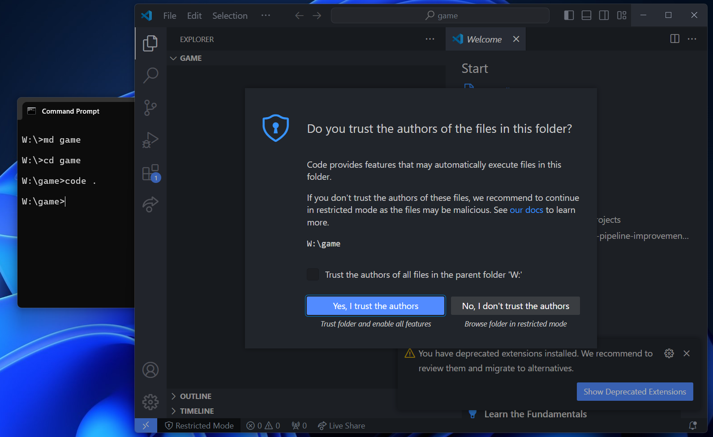
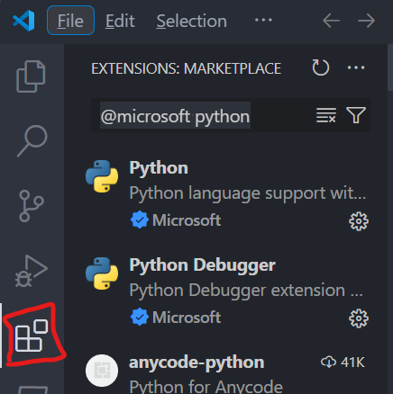
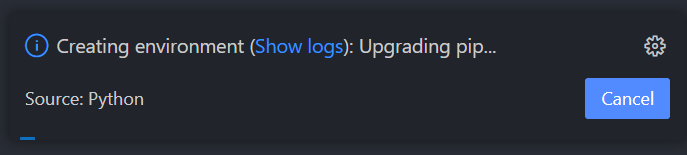
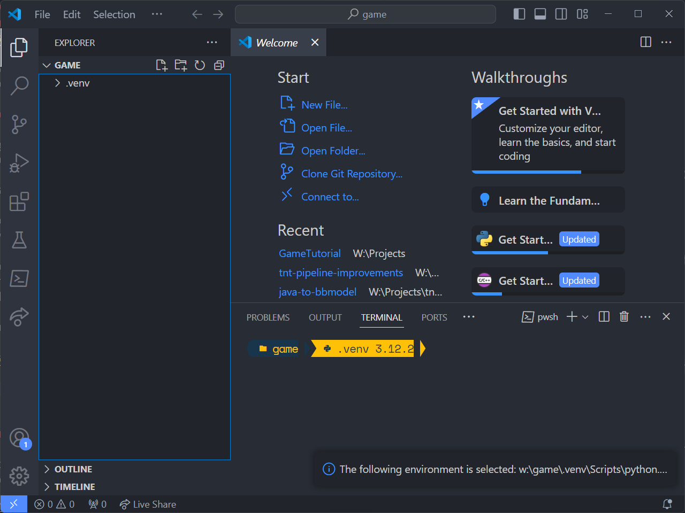

# Space shooter game

## Introduction

We are going to make a space shooter game using the programming language [python](https://docs.python.org/3/). We will use a game developement framework called [pgzero](https://pygame-zero.readthedocs.io/en/stable/index.html) which is based on [pygame](https://www.pygame.org/docs/). You can find documentation about the frameworks on these sites if you get stuck.

## Get started

Install the following on your computer:

1.  [Install python](https://www.python.org/downloads/)
    1. Click the big yellow button under "Download the latest version for Windows".
    1. Once downloaded, start the installer.
    1. Make suer to check "Add python.exe to PATH"
    1. Click "Install Now"
1. [Install Visual Studio Code](https://code.visualstudio.com/download)
    1. Click the blue download button for Windows.
    1. Once downloaded, start the installer and follow the instructions.
1. [Install Windows Terminal](https://aka.ms/terminal)
    1. Download and install the terminal application from the windows store 

### Create your development environment

Before we get started we need to setup your development environment, the things you have downloaded and installed are part of this but there are a few more things we need to do before we can get started.

#### Test that python is installed correctly

We need to start by making sure you have everything correctly installed. 

**Start the Windows Terminal**


You can find the terminal from the windows start menu by searching for "windows terminal".



You should see a window that looks like this: (Note that the text in the terminal is going to be different on your computer, instead of `W:\>`, it might say something else, that is OK)



In the terminal type:

```shell
W:\>python --version
```

You should see something like this: (Note that the number might differ, that is the version of python you have installed, it should start with 3)

```shell
W:\>python --version
Python 3.12.2
```

If this is not what you see, please make sure you have installed Python correctly from the link above.

#### Create your game directory

You can actually create a directory from the terminal. That is done through the `md` command, which stands for Make directory.

In the terminal type:

```shell
W:\>md game
```

This will create a subdirectory on your hard drive under the directory you are currently in.

Move in to the directory by the `cd` command, which stands for Change directory.

```shell
W:\>cd game

W:\game>
```

#### Open Visual Studio Code

You can also start apps from the terminal, the Visual Studio Code app you installed earlyer can be started with the `code` command. You need to pass the current directory to `code`, you do that with the `.` argument. You need a space (` `) between the command and the argument.

```shell
W:\game>code .
```

This should open Visual Studio Code in your game directory you just created.



If you get prompted "Do you trust the authors of the files in this folder?", you can click "Yes, I trust the authors", since you are going to be the author.

#### Install python extensions

VS Code doesn't have support for python by default so we need to extend it. This is done through extensions. On your left side, you find an icon that looks like four boxes, click it.



In the extension tab, search for `@microsoft python` and install `Python` and `Python Debugger`.

#### Create a python virtual enviroment

We need to creating a virtual enviroment for our game. This is good practice to do when working with python.

In the menu, navigate to `View > Command Palette`.

In the command palette type: `>Python: create` and click on `Python: Create Environment...`.

You will be prompted to select between `Venv` and `Conda`, select `Venv`. Next, select your installed Python installation `Python 3.12.2 64-bit`.

A small window should appear:



In your tabs view you should now see a folder called `.venv`.



#### Open the Terminal from within Visual Studio Code

To begin with, you want to open the terminal again, but from within Visual Studio Code.

In the menu, locate to `Terminal > New Terminal` to open the Terminal. This way you don't need to move between the terminal and Visual Studio Code.

#### Activate virtual environment

From the terminal write the following `.\.venv\Scripts\activate`:

```shell
W:\game>.\.venv\Scripts\activate

(.venv) W:\game>
```


#### Install pgzero

Now it's time to install the game developement framework `pgzero`. That is also done through the terminal.

```
W:\game>pip install pgzero
```

## Setup done, good job!

Now follow the instructions in [Section0 (Hello World)](section0/)