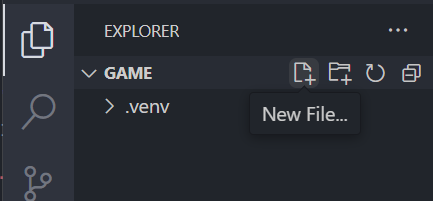
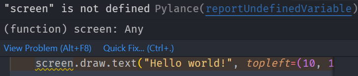
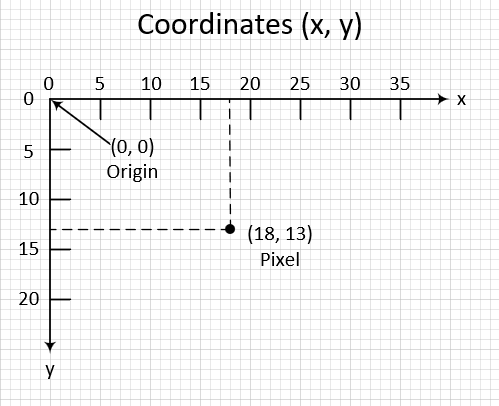
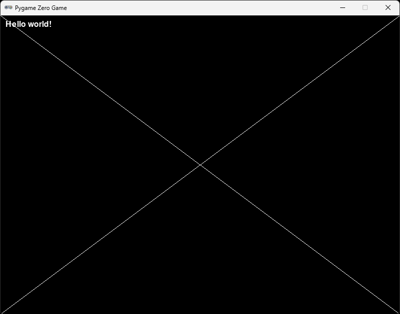

# Chapter 0 (Hello world)

## About

In this section we are going learn some basics. We are going to draw some text in a window. The text "Hello world!" has been used by programmers forever to test that things are working as it should. We will go through the coordinate system used by computers to draw things to the screen and we will draw some lines.

## Create a new file

That is easiest done through the file tab witin VS Code.



Name the file `game.py`.

With game.py open, write the following.

```python
def draw():
    screen.draw.text("Hello world!", topleft=(10, 10))
```

Take it slow when writing code, it is important that new lines and spaces are kept exatly as written above. Take your time and don't stress.

## Run your program

In the terminal write the following and hit enter.

```shell
W:\game>pgzrun game.py
```

This should open a new window with the text "Hello world!" written. If this doesn't happen, make sure that the code is written exactly as above.

### ✏️ Try on your own

> 📋 Try changing the text to something other than "Hello world!".

> 📋 Try changing where the text appears on the screen. 💡Hint: look at `topleft=(10, 10)`.

To run the code again after your changes, just write `pgzrun game.py` and hit enter again in the terminal.


## Run the program from VS Code

In order to run the program from within VS Code, we need to add some more code.
When using the `pgzrun` command from the terminal it sets everything up for us, but the code is just a python file that doesn't know anything about `pgzero`, let's change that.

At the top of your code, write:

```python
import pgzrun

```

This means that we tell python that we want to use the `pgzrun` module.

At the end of your code, wirte:

```python
pgzrun.go()
```

This means that we call a function called `go` from the `pgzrun` module. The parantheses `()` tells the computer that you want to run the function.

Your complete code should now look like this:

```python
import pgzrun

def draw():
    screen.draw.text("Hello world!", topleft=(10, 10))

pgzrun.go()
```

▶️ **Run the game and see that it works (press `F5`)**. Select "**Python File** Debug the currently active Python file" in the list that appears.

## Fixing the warning

You have a warning in the code. It is marked with a squiggly line under the word `screen`. If you move your mouse over the warning it will give you a hint about what is potentially wrong.



Now this is just a warning. The reson for the warning is that VS Code doesn't know what screen is. The code is working though so this is just a warning. You can fix the warning by giving VS Code a hint about what `screen` is.

Write the following directly under `import pgzrun`:

```python
from pgzero.screen import Screen
screen: Screen
```

Now the warning should disapear and you should be able to trust that something might be off if you see these squiggly lines in the future.

## Coordinate system

Note that the coputers coordinate system starts at the top left corner of the window. So the text you have written is placed 10 pixels to the right, and 10 pixels from the top in the game window, which is what `(10, 10)` means. In the image below we illustrate where a pixel would be placed if it is placed at `(18, 13)`, meaning `x` is set to `18` and `y` is set to `13`.



### Draw a line

Let's draw some lines starting from the middle of the window to all corners. This is a good way for you to get a feeling of how the coordinate system works. I happen to know that the window is 800 pixels wide and 600 pixels high.

We will use the `screen.draw.line` [function](https://learnpython.org/en/Functions) for this that takes the following arguments:

```python
screen.draw.line(start, end, color)
```

Add `screen.draw.line((400, 300), (800, 600), (255, 255, 255))` to your code, like so:

```python
def draw():
    screen.draw.text("Hello world!", topleft=(10, 10))
    screen.draw.line((400, 300), (800, 600), (255, 255, 255))
```

We have replaced `start` with `(400, 300)` meaning we want to start at x 400 and y 300 (note that that is half the width and height of the window).
Next, we have replaced `end` with `(800, 600)` meaning that we want to draw the line to the bottom right corner of the window. Last we have replaced color with (255, 255, 255) which means white. 

▶️ **Run the game and see that it works (press `F5`)**

Next, add the following line, just below:

```python
    screen.draw.line((400, 300), (800, 0), (255, 255, 255))
```

Now we draw a line from the middle of the creen to the top right corner.

▶️ **Run the game and see that it works (press `F5`)**

One more:

```python
    screen.draw.line((400, 300), (0, 600), (255, 255, 255))
```

Can you make the last line going from the center to the top right corner `(0, 0)`?

▶️ **Run the game and see that it works (press `F5`)**, you should have a result looking like this:



### ✏️ Try on your own

> 📋 Explore what else you can draw, in the next section we will draw a spaceship using an image but you can draw circles, rectangles and other geometric shapes without loading an image. To find out what is available, google "gpzero screen draw". You should be able to find documentation about what is available.

## Stuck?

If you get stuck, you can find the complete code here:
* [game.py](./game.py)

## Next

Next up, [Chapter 1 (Draw a spaceship)](../chapter01)
