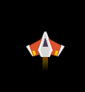

# Chapter 6 (Adding thrusters to the ship)

## About

In this section we will add thrusters to the ship. We will make sure the thrusters only show when the ship is moving.

## Add thruster images

Look for a thruster image in the asset packs you downloaded previously. I've picked the image called `fire10.png` that is located under `kenney_space-shooter-redux\PNG\Effects\fire10.png`, but you can pick any of the other fire images.

Copy the image you have selected over to the `images` directory you created previously and name it `thruster`.

## Load the thruster image

In the `__init__` method of your `player.py` file, under the `self.actor.scale = 0.5`, add the following line to load the thruster as an Actor:

```python
        self.main_thruster = Actor("thruster", anchor=("center", "top"))
        self.scale = 0.5
```

We set the `anchor` to center top to make it spin around the center top of the image when we rotate the image (more on that later). We also scale it by half to match the size of the ship.

## Place and draw the main thruster
In the `position_player` method, add the following line to place the thruster at the bottom center of the ship:

If you don't have a `position_player` method, you got asked to make it in previous section. Check the previous sections [player.py](../chapter05/player.py) for reference.

```python
    def position_player(self):
        ...
        self.main_thruster.pos = self.actor.midbottom
```

Now it's time to draw the thruster. In the `draw` method, add the following line:

```python
    def draw(self):
        self.main_thruster.draw()
```

▶️ **Run the game and see that it works (press `F5`)**, your ship should have a thruster at the bottom now like this:



Let's make the thruster only show when we move the ship forward. In order to do so, we can check if the y component of the force is smaller than 0 (meaning we are moving up) and show the thruster only then.

```python
    def draw(self):
        if self.force.y < 0:
            self.main_thruster.draw()
```

▶️ **Run the game and see that it works (press `F5`)**, the thruster should only show when you move the ship forward.

Now it's time to add the side thrusters. We will do this similarly to the main thruster, but with some other placement and controlled by the x component of the force.

```python
    def (self, window_width: int, window_height: int):
        ...
        self.right_thruster = Actor("thruster", anchor=("center", "top"))
        self.right_thruster.scale = 0.5
        self.right_thruster.angle = 90
        self.left_thruster = Actor("thruster", anchor=("center", "top"))
        self.left_thruster.scale = 0.5
        self.left_thruster.angle = -90
        ...

    def position_player(self):
        ...
        self.right_thruster.pos = self.actor.midright + Vector2(-6, 6)
        self.left_thruster.pos = self.actor.midleft + Vector2(6, 6)
        ...

    def draw(self):
        ...
        if self.force.x < 0:
            self.right_thruster.draw()

        if self.force.x > 0:
            self.left_thruster.draw()

```

I've tried positioning the thrusters so they are a bit behind the ship and a bit down from the center of the ship. You can adjust the position by changing the `Vector2` values.

▶️ **Run the game and see that it works (press `F5`)**, the thrusters should only show when you move the ship in the respective direction.

Lastly we add a front thruster, that will fire when we move backwards. The ship is also supposed look like it is always moving forward unless we move backwards. Let's add a second main thruster draw call that will show when the y force is smaller or equal to 0, makig it show when we stand still.

```python
    def (self, window_width: int, window_height: int):
        ...
        self.front_thruster = Actor("thruster", anchor=("center", "top"))
        self.front_thruster.scale = 0.5
        self.front_thruster.angle = 180
        ...

    def position_player(self):
        ...
        self.front_thruster.pos = self.actor.midtop + Vector2(0, 6)
        ...

    def draw(self):
        if self.force.y <= 0:
            self.main_thruster.draw()
        ...
        if self.force.y > 0:
            self.front_thruster.draw()
        ...
```

In total your `draw` method should look like this:

```python
    def draw(self, screen: Screen, debug: bool = False):
        if self.force.y <= 0:
            self.main_thruster.draw()

        if self.force.y > 0:
            self.front_thruster.draw()
        if self.force.y < 0:
            self.main_thruster.draw()

        if self.force.x < 0:
            self.right_thruster.draw()
        if self.force.x > 0:
            self.left_thruster.draw()

        self.actor.draw()

        if debug:
            self.print_vector(screen, "Force", self.force, 10, 10)
            self.print_vector(screen, "Acceleration", self.debug_acceleration, 10, 30)
            self.print_vector(screen, "Velocity", self.velocity, 10, 50)
```

▶️ **Run the game and see that it works (press `F5)**, you should have thrusters now in all direction, plus one at the back of the ship that always show unless you move backwards. Your game should look something like this:


### ✏️ Try on your own

> 📋 Play around with the position of the thrusters. Perhaps you want to draw you own? Or have different thrusters on the sides, back and front?

## Stuck?

If you get stuck, you can find the complete code here:
* [game.py](./game.py)
* [player.py](./player.py)

## Next

Next up, [Chapter 7 (Asteroids)](../chapter07)