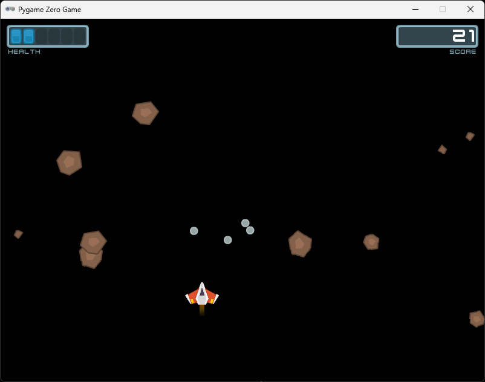

# Chapter 9 (Projectiles and explosions)

## About

In this section we are going to add explosions to the asteroids when they are destroyed. We will also add projectiles to the player so that we can shoot the asteroids.

## Explosions

### Download assets

The asset packs we have downloaded previously doesn't contain any good explosion images, but Kenny has some explosion assets in the [Tanks Pack](https://kenney.nl/assets/tanks) that we can use. Download the Tanks Pack and unpack it.

The explosion images we are going to use are called:
* `tank_explosion1.png`
* `tank_explosion9.png` 
* `tank_explosion10.png`
* `tank_explosion11.png`

Copy the images to your `images` directory. And name them the following:
*  `gray_explosion1.png`
*  `gray_explosion2.png`
*  `gray_explosion3.png`
*  `gray_explosion4.png`

### Create the explosion class

Create a new file called `explosion.py` in the root of your game directory. In `explosion.py`, add the following:

```python
from pgzero.actor import Actor

class Explosion(Actor):
    def __init__(self, actor: Actor):
        super().__init__("gray_explosion1", (actor.x, actor.y))
```

This is a simple class that extends the `Actor` class. It takes an `Actor` as an argument and places the explosion at the same position as the actor.

### Instantiate the explosion

In `asteroid_field.py`, import the `Explosion` class at the top of the file:

```python	
from explosion import Explosion
```

In the `AsteroidField` class, let's add an array that will hold all the explosions:

```python
    def __init__(self, window_width: int, window_height: int):
        self.explosions: List[Exception] = []
        ...
```

Now, let's add a new Explosion to the list when an asteroid is destroyed. In the `remove_asteroid` method, add the following code:

```python
    def remove_asteroid(self, asteroid: Asteroid):
        self.explosions.append(Explosion(asteroid))
        ...
```

Now we just have to call draw on the explosions. In the `draw` method, add the following code:

```python
    def draw(self):
        for explosion in self.explosions:
            explosion.draw()
```

▶️ **Run the game and see that it works (press `F5`)**, a dot should appear when you destroy an asteroid.



### Animate the explosion

To animate the explosion, we need to change the image of the explosion over time. We can do using our pgzhelper module. In `explosion.py`, start by importing everything from the `pgzhelper` module:

```python
from pgzero.actor import Actor
from pgzhelper import *
```

Then, add the following code to the `Explosion` class:

```python
class Explosion(Actor):
    def __init__(self, actor: Actor):
        super().__init__("gray_explosion1", (actor.x, actor.y))
        self.images = ["gray_explosion1", "gray_explosion2", "gray_explosion3", "gray_explosion4", "gray_explosion4"]
        self.fps = 10
```

This code adds a list of images to the explosion and sets the frames per second of the animation to 10. Note that we have two of the same image, this is a hack that we will come to later.

Now we need to update the image of the explosion over time. Add the following code to the `Explosion` class:

```python
    def animate_once(self) -> bool:
        frame = self.animate()
        done = frame == len(self.images) - 1
        return done
```

This code will animate the explosion and return `True` when the animation is done.

The `animate` method is provided by the `pgzhelper` module. It will change the image of the explosion over time. It will also return the current frame of the animation. We check if the frame is the last frame in the `images` list and return `True` if it is. This is also we have duplicated the last image in the list, since it would return `True` one frame too early otherwise.

Now we need to call `animate_once` from the update method in `asteroid_field.py`. Add the following code to the `update` method:

```python
    def update(self):
        for explosion in self.explosions:
            if explosion.animate_once():
                self.explosions.remove(explosion)

        ...
```

▶️ **Run the game and see that it works (press `F5`)**, you should now see explosions when an destroy is asteroid.

## Projectiles

### Assets

We need an image to use as a projectile. You can use the `laserBlue01.png` from the [Space Shooter Redux](https://kenney.nl/assets/space-shooter-redux) asset pack. You should have it downloaded since before. Copy the image to your `images` directory and name it `laser1.png`.


### Create the projectile class

Create a new file called `projectile.py` in the root of your game directory. In `projectile.py`, add the following, you should know the drill by now 😉:

```python
from pgzero.actor import Actor

class Projectile(Actor):
    def __init__(self, image: str, start_pos: tuple[int, int]):
        super().__init__(image, start_pos)
```

Notice the start_pos parameter in the constructor. This is a tuple that holds the x and y start position of the projectile. We have used tupels before, every time we use parantheses `()` with comma separated values, we create a tuple, like `(x, y)`.

### Projectile physics

Now let's add some physics to the projectile. We will do this similar to how we did it with the `Player`: `force` ➡️ `acceleration` ➡️ `velocity` ➡️ `position`. We want to make sure we can set the force in the constructor. 

In the `Projectile` class, add the following code:

```python
from pygame import Vector2

class Projectile(Actor):
    def __init__(self, image: str, xy: tuple[int, int], force: Vector2):
        super().__init__(image, xy, anchor=("center", "bottom"))
        self.force = force
        self.acceleration = Vector(0, 0)
        self.velocity = Vector(0, 0)
        self.mass = 1
```

Let's add an update function, remember to set the acceleration to zero after we have updated the position. Add the following code to the `Projectile` class:

```python
    def update(self):
        self.acceleration = self.force / self.mass
        self.velocity += self.acceleration
        self.pos += self.velocity
        self.acceleration = Vector2(0, 0)
```

### Instantiate the projectile

In `player.py`, import the `Projectile` class at the top of the file:

```python
from projectile import Projectile
```

We need to make a list to store the projectiles in. In the `Player` class, add the following code:

```python
    def __init__(self, window_width: int, window_height: int):
        ...
        self.projectiles: List[Projectile] = []
```

Let's use the space bar to shoot a projectile. In the handle input method, add the following code:

```python
    def handle_input(self):
        ...

        if keyboard.space:
            self.projectiles.append(Projectile("laser1", (self.actor.x, self.actor.y), Vector2(0, -1)))
```

We also need to update the projectiles. In the `update` method, add the following code:

```python
    def update(self):
        ...
        for projectile in self.projectiles:
            projectile.update()
```

...and draw the projectiles. In the `draw` method, add the following code:

```python
    def draw(self):
        for projectile in self.projectiles:
            projectile.draw()
        ...
```

I want the projectile to draw under the player, that's why I put it at the top of the draw method.

▶️ **Run the game and see that it works (press `F5`)**, you should now be able to shoot projectiles.

Now there are two problems here. 

#### Problem 1️⃣, we have a trail of projectiles:


If this is what you want, you don't have to do anything. But if you want to shoot one laser at a time, we need to change the code a bit. The problem is that we are using the `handle_input`, which is continous meaning that it is called every frame. In this case we want the laser to spawn only when we press the space bar, and not while the space bar is pressed. We can do this using a function provided by pgzero called `on_key_down`.

In the `game.py` file, add the following code:

```python
def on_key_down(key):
    player.handle_key_down(key)
```

And in the `Player` class, add the following code above the `handle_input` method:

```python
    def handle_key_down(self, key):
        pass

    def handle_input(self):
        ...
```

Now let's move the code we have for adding a projectile from the `handle_input` method to the `handle_key_down` method:

```python
    def handle_key_down(self, key):
        if keyboard.space:
            self.projectiles.append(Projectile("laser1", (self.actor.x, self.actor.y), Vector2(0, -1)))
```

We also need to change the `if statement` from `if keyboard.space` to `if key == keys.SPACE`.

```python
    def handle_key_down(self, key):
        if key == keys.SPACE:
            self.projectiles.append(Projectile("laser1", (self.actor.x, self.actor.y), Vector2(0, -1)))
```

Finally we need to import `keys` from `pgzero.builtins` at the top of the file add `keys` to the list of things we import from `pgzero.builtins`:

```python
from pgzero.builtins import Actor, keyboard, keys
```

▶️ **Run the game and see that it works (press `F5`)**, you should now only be able to shoot one laser at a time.

#### Problem 2️⃣, we never remove projectiles:

The projectiles will keep going forever. This is an extra scary problem since it is invisible. If we never remove the projectiles, the game will eventually slow down and even crash. We need to remove the projectiles when they are outside the window. In the `update` method in the `Player` class, add the following code:

```python
    def update(self):
        ...
        for projectile in self.projectiles:
            projectile.update()
            if projectile.bottom < 0:
                self.projectiles.remove(projectile)
```

▶️ **Run the game and see that it works (press `F5`)**, you should now be able to shoot projectiles and they should disappear when they are outside the window.


We can test that it works by printing the length of the `projectiles` list. If the length is decreasing, we are removing the projectiles correctly.

```python
    def update(self):
        ...
        
        print(len(self.projectiles))
```

▶️ **Run the game and see that it works (press `F5`)**, you should see `0` in the terminal changing to `1` and `2` when you shoot. It should however go back to `0` when the projectile is outside the window.

You can remove the `print` statement when you have tested that it works.

### Collision detection

Now we want to check if the projectiles hit the asteroids.

In the `game.py` file, add the following code under where we check if the player is hit.

```python
    for asteroid in asteroid_field.asteroids:
        for projectile in player.projectiles:
            if projectile.colliderect(asteroid):
                asteroid_field.remove_asteroid(asteroid)
                player.projectiles.remove(projectile)
```

### Refactor

We can optimize the game loop to ovoid looping through the asteroids twize. Change the update function to this:

```python
from pgzhelper import *

...

def update():
    points = asteroid_field.update(points)
    player.update()

    for asteroid in asteroid_field.asteroids:
        if asteroid.circle_collidecircle(player.actor):
            player.take_damage()
            asteroid_field.remove_asteroid(asteroid)

            if player.health <= 0:
                print("Game Over")
                print("Score: ", points)
                quit()

        for projectile in player.projectiles:
            if projectile.colliderect(asteroid):
                asteroid_field.remove_asteroid(asteroid)
                player.projectiles.remove(projectile)
```
Remember to import everything from `pgzhelper` since we use the `circle_collidecircle` from that module.

We can also remove the `check_collision` method from the `AsteroidField` class since we don't need it anymore.

▶️ **Run the game and see that it works (press `F5`)**, you should now be able to shoot the asteroids and get hit by them still.

We are now done with this section, you should now have a game that looks like this:


### ✏️ Try on your own

> 📋 Play around with the laster, is it moving fast enough? Change it until you feel it feels good.

## Stuck?

If you get stuck, you can find the complete code here:

* [game.py](./game.py)
* [player.py](./player.py)
* [projectile.py](./projectile.py)
* [explosion.py](./explosion.py)
* [asteroid_field.py](./asteroid_field.py)

## Next

Next up, [Chapter 10 (UI and game state)](../chapter10)
