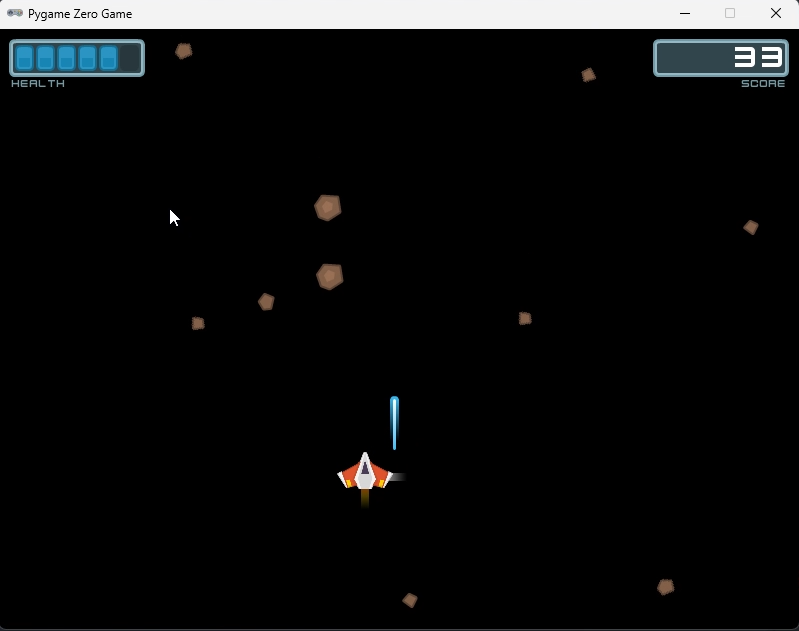

# Chapter 10 (UI and game state)

## About

In this section we are going to build some more UI for our game. We will create a menu and a game over screen.

## Create a new file

Create a new file called `menu.py`, and add the following code:

```python   

```


▶️ **Run the game and see that it works (press `F5`)**, 



### ✏️ Try on your own

> 📋 Lorem ipsum

## Stuck?

If you get stuck, you can find the complete code here:

* [game.py](./game.py)
* [player.py](./player.py)
* [hud.py](./hud.py)
* [asteroid_field.py](./asteroid_field.py)

## Next

Next up, [Chapter 9 (Game over and restart)](../chapter09)
