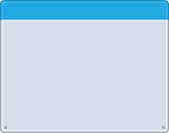
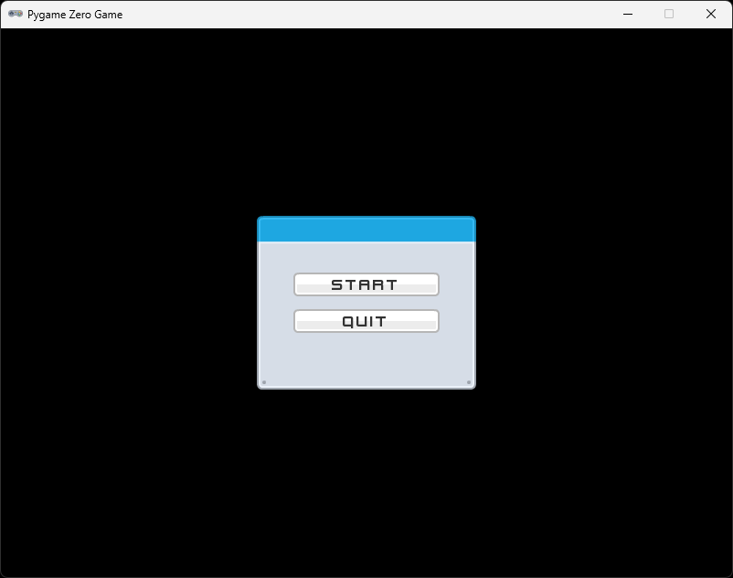
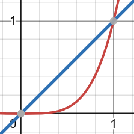

# Chapter 10 (UI and game state)

## About

In this section we are going to build some more UI for our game. We will create a menu and a game over screen. But first we will create a strucuture to store and change the game state.

## Game state

We are going to create a main menu and some other screens in this and upcoming chapters. We need a way to keep track of what screen we are currently on. We are going to create a new file called `game_state.py` and add the following code:

```python
from enum import Enum

class GameState(Enum):
    MAIN_MENU = 1
    GAME = 2
```

This is a simple enum that we use to hold the different states of the game. We will add more states later but for now we only have two states, `MAIN_MENU` and `GAME`.

The state the game is in right now is the `GAME` state. Now let's create a strucutre that is responsible for changing the game state.

In the same file, create a class called `Game`:

```python
...

class Game:
    def __init__(self):
        self.state = GameState.GAME

    def update(self):
        match self.state:
            case GameState.MAIN_MENU:
                pass
            case GameState.GAME:
                pass

    def draw(self):
        match self.state:
            case GameState.MAIN_MENU:
                pass
            case GameState.GAME:
                pass
```

We use some new keyword here called `match` and `case`. This is a feature in Python called pattern matching. It works similar to `if` and `elif` but can be easier to read in situations like this.

The same code can be written like this using `if`:

```python
...

    def update(self):
        if self.state == GameState.MAIN_MENU:
            pass
        elif self.state == GameState.GAME:
            pass

...
```

### Move the game code

Now let's move the code we have in `game.py` to the new `Game` class, starting with the draw function. Place it in the `draw` method under the `GAME` case:

```python
...

class Game:
    ...

    def draw(self):
        match self.state:
            case GameState.MAIN_MENU:
                pass
            case GameState.GAME:
                screen.clear()

                asteroid_field.draw()
                player.draw(screen, False)

                draw_healtbar(screen, 10, 10, player.health)
                draw_score(screen, points, WIDTH - 10, 10)
```

We can move the `screen.clear()` up over the `match self.state:` line, since we want to clear the screen no matter what the state is.

You get warnings that `asteroid_field`, `player`, `draw_healtbar` and `draw_score` are not defined. `asteroid_field` and `player` are objects that we need to create in the `__init__` constructor of this class, let's start with that.

```python
...
from asteriod_field import AsteroidField
from player import Player

class Game:
    def __init__(self):
        self.state = GameState.GAME
        self.asteroid_field = AsteroidField()
        self.player = Player()
```

In the `update` method, we need to change `asteroid_field` and `player` to `self.asteroid_field` and `self.player`:

```python
...

    def draw(self):
        screen.clear()

        match self.state:
            case GameState.MAIN_MENU:
                pass
            case GameState.GAME:
                self.asteroid_field.draw()
                self.player.draw(screen, False)

                ...
```

We fix the warnings for `draw_healtbar` and `draw_score` by importing them from `hud.py`:

```python
...

from hud import draw_healtbar, draw_score
```

We still have a warning that `screen`, `points` and `WIDTH` are not defined. Let's start with `screen`. We need to pass it in to the `draw` method like this:

```python
from pgzero.screen import Screen
...

class Game:
    ...

    def draw(self, screen: Screen):
```

`points` we can fix by adding it as a member variable in the `Game` class, while in the `__init__` method we we can also add `window_width` and `window_height` as arguments. Finally let's rename `points` to `score`.

The constructor of your `Game` class should look like this:

```python
class Game:
    def __init__(self, window_width: int, window_height: int):
        self.state = GameState.MAIN_MENU

        self.window_width = window_width
        self.window_height = window_height
        
        self.player = Player(window_width, window_height)
        self.asteroid_field = AsteroidField(window_width, window_height)

        self.score = 0
```

Now we can fix the two last warnings in the `draw` method:

```python
...

    def draw(self, screen: Screen):
        screen.clear()

        match self.state:
            case GameState.MAIN_MENU:
                pass
            case GameState.GAME:
                self.asteroid_field.draw()
                self.player.draw(screen, False)

                draw_healtbar(screen, 10, 10, self.player.health)
                draw_score(screen, self.score, self.window_width - 10, 10)

```

Now it's time to move the `update` logic to the `Game` class. Copy everything from the `update` method in `game.py` and paste it into the `update` method in the `Game` class, skip the `global points` line since we have a member variable for that now:

```python
...

class Game:
    ...

    def update(self):
        match self.state:
            case GameState.MAIN_MENU:
                pass
            case GameState.GAME:
                points = asteroid_field.update(points)
                player.update()

                for asteroid in asteroid_field.asteroids:
                    if asteroid.circle_collidecircle(player.actor):
                        player.take_damage()
                        asteroid_field.remove_asteroid(asteroid)

                        if player.health <= 0:
                            print("Game Over")
                            print("Score: ", points)
                            quit()

                    for projectile in player.projectiles:
                        if projectile.colliderect(asteroid):
                            asteroid_field.remove_asteroid(asteroid)
                            player.projectiles.remove(projectile)
```

See if you can fix the warnings by yourself. What you need to do is change `points` to `self.score`, `asteroid_field` to `self.asteroid_field` and `player` to `self.player`. You should have something that looks like this once you're done:

```python
...

    def update(self):
        match self.state:
            case GameState.MAIN_MENU:
                pass
            case GameState.GAME:
                self.score = self.asteroid_field.update(self.score)
                self.player.update()

                for asteroid in self.asteroid_field.asteroids:
                    if asteroid.circle_collidecircle(self.player.actor):
                        self.player.take_damage()
                        self.asteroid_field.remove_asteroid(asteroid)

                        if self.player.health <= 0:
                            print("Game Over")
                            print("Score: ", self.score)
                            quit()

                    for projectile in self.player.projectiles:
                        if projectile.colliderect(asteroid):
                            self.asteroid_field.remove_asteroid(asteroid)
                            self.player.projectiles.remove(projectile)
```

Before we can change the `game.py` file to use the `Game` class, we need to move the `def on_key_down(key):` function to the `Game` class. Add it to the class like this:

```python
...
class Game:
    ...

    def on_key_down(self, key):
        match self.state:
            case GameState.GAME:
                self.player.handle_key_down(key)
            case _:
                pass

```

Note the `case _:` line, this is a catch all case that will match anything that is not `GameState.GAME`. In our case we only want to handle key presses in the `GAME` state, so we can ignore everything else.

We start by cleaning up the imports. We can remove the import from `player`, `asteriod_field`, `pgzhelper` and `hud`.

Your `game.py` file should look like this:

```python
import pgzrun

from pgzero.screen import Screen
screen: Screen
```

Now let's import the `Game` class from `game_state`:

```python
from game_state import Game
```

You can keep the WIDTH and HEIGHT variables, but remove the initialization of `points`, `player` and `asteroid_field`. If you have not removed the code from the `update`, `draw` and `on_key_down` functions, do that now.

Let's also make a new game variable from the `Game` class:

```python
game = Game(WIDTH, HEIGHT)
```

You should now have a `game.py` file that looks like this:

```python
import pgzrun
from pgzero.screen import Screen
screen: Screen

from game_state import Game

WIDTH  = 800
HEIGHT = 600

game = Game(WIDTH, HEIGHT)

def update():

def draw():

def on_key_down(key):

pgzrun.go()
```

Now let's call `update`, `draw` and `on_key_down` from the `Game` class. Add the following code to the `update`, `draw` and `on_key_down` functions:

```python
def update():
    game.update()

def draw():
    game.draw(screen)

def on_key_down(key):
    game.on_key_down(key)
```

▶️ **Run the game and see that it works (press `F5`)**, everything should work as before.


## Create the menu

### Menu assets

Before we create the menu, there are some assets we need. I've used `metalPanel_blue.png` from the `kenney_ui-pack-space-expansion` to create a panel background for the menu.



Download it from here [ui_window1.png](images/ui_window1.png).

To create a button, I've used `barHorizontal_white_left.png`, `barHorizontal_white_mid.png` and `barHorizontal_white_right.png` also from the `kenney_ui-pack-space-expansion` to create a button.


Download it from here [ui_button.png.png](images/ui_button.png.png).

I've also used `barHorizontal_blue_left.png`, `barHorizontal_blue_mid.png` and `barHorizontal_blue_right.png` from the same pack to create another button we will use when the player moves the mouse over the button.


Download it from here [ui_button_hover.png](images/ui_button_hover.png).

Save the images to your images folder.

### Adding the menu

Create a new file called `ui_menu.py`, and add the following code:

```python
from pgzero.builtins import Actor

class Menu:
    def __init__(self, window_width: int, window_height: int):
        self.window_width = window_width
        self.window_height = window_height

        self.frame = Actor('ui_window1', anchor=("center", "center"), pos=(window_width / 2, window_height / 2))
```

We need some buttons for the menu. Let's create a module that can contain reusable ui elements, like buttons. Create a new file called `ui.py` and add the following code:

```python
from pgzero.builtins import Actor

class Button(Actor):
    def __init__(self, text: str, x: int, y: int):
        super().__init__("ui_button", anchor=("center", "center"))
        self.text = text
        self.text_color = (50, 50, 50)
        self.x = x
        self.y = y
```

We take in a `text` as an argument to the constructor. We also take in `x` and `y` to position the button on the screen. We set the `text_color` to a dark gray color.

We also need to draw the button.

```python
from pgzero.screen import Screen

...

class Button(Actor):
    ...

    def draw(self, screen: Screen):
        super().draw()
        screen.draw.text(
            self.text, 
            center=(self.x, self.y), 
            fontsize=18, 
            fontname="kenny", 
            color=self.text_color
        )
```

We draw the button by calling the `super().draw()` method. This will draw the button image. We then draw the text on top of the button.

Next up we are going to use our newly created buttons in the `Menu` class. Add the following code to the `Menu` class:

```python
from pgzero.screen import Screen
from ui import Button

class Menu:
    def __init__(self, window_width: int, window_height: int):
        ...

        self.play_button = Button("start", self.frame.centerx, self.frame.centery - 20)
        self.quit_button = Button("quit", self.frame.centerx, self.frame.centery + 20)

    def draw(self, screen: Screen):
        self.frame.draw()
        self.play_button.draw(screen)
        self.quit_button.draw(screen)
```

Finally we need to add the `Menu` to our `Game` class. Add the following code to the `game_state.py` file:

```python
class Game:
    def __init__(self, window_width: int, window_height: int):
        self.state = GameState.MAIN_MENU

        ...        

        self.menu = Menu(window_width, window_height)
```

We also need to make sure we draw the menu in case we are at the `MAIN_MENU` state. Add the following code to the `draw` method in the `Game` class:

```python
class Game:
    ...

    def draw(self, screen: Screen):
        screen.clear()

        match self.state:
            case GameState.MAIN_MENU:
                self.menu.draw(screen)
            case GameState.GAME:
                ...
```

▶️ **Run the game and see that it works (press `F5`)**, since we changed the `state` to `MAIN_MENU` in the `Game` constructor, you should see the menu when you run the game.



## Menu interaction

As you saw, the menu is not working yet. It only shows the buttons but we can't interact with them. Let's fix that.

Let's start by adding a new method to the `Button` class that checks if the mouse is over the button. Add the following code to the `Button` class:

```python
...

class Button(Actor):
    ...

    def on_mouse_move(self, pos):
        if self.collidepoint(pos):
            self.image = "ui_button_hover"
            self.text_color = (250, 250, 250)
        else:
            self.image = "ui_button"
            self.text_color = (50, 50, 50)
    
    ...
```

We check if the mouse is over the button by calling the `collidepoint` method where `pos` will contain the mouse position (x, y). If the mouse is over the button, we change the image to `ui_button_hover` and set the `text_color` to light gray. If the mouse is not over the button, we change the image back to `ui_button` and set the `text_color` to dark gray.

We also need to add a method to the `Menu` class that calls the `on_mouse_move` method on the buttons. Add the following code to the `Menu` class:

```python
...

class Menu:
    ...

    def on_mouse_move(self, pos):
        self.play_button.on_mouse_move(pos)
        self.quit_button.on_mouse_move(pos)
```

To hook up the `on_mouse_move` method to the `on_mouse_move` event, we need to add the following code to the `Game` class:

```python
...

class Game:
    ...

    def on_mouse_move(self, pos):
        match self.state:
            case GameState.MAIN_MENU:
                self.menu.on_mouse_move(pos)
            case _:
                pass
```

Finally, we need to add the `on_mouse_move` method to the `game.py` file. Add the following code to the `game.py` file:

```python
...

def on_mouse_move(pos):
    game.on_mouse_move(pos)
```

▶️ **Run the game and see that it works (press `F5`)**, you should now see the button change when you move the mouse over it.

Next up we are going to make the button clickable. We will use the built in `on_mouse_down` event for this. We can add it directly to the `game.py` file. Add the following code to the `game.py` file:

```python
def on_mouse_down(pos, button):
    game.on_mouse_down(pos, button)
```

We need to add the `on_mouse_down` method to the `Game` class. Add the following code to the `Game` class:

```python
...

class Game:
    ...

    def on_mouse_down(self, pos, button):
        match self.state:
            case GameState.MAIN_MENU:
                self.menu.on_mouse_down(pos, button)
            case _:
                pass
```

...and add it to the `Menu` class:

```python
...

class Menu:
    ...

    def on_mouse_down(self, pos, button):
        if button == mouse.LEFT:
            if self.play_button.collidepoint(pos):
                print("Start game")
            elif self.quit_button.collidepoint(pos):
                quit()
```

Now, we don't want to take any action here, and there is no way for us to change the game state from the menu itself. We need to return some kind of action from the `on_mouse_down` method. We can do this by returning an enum from the `on_mouse_down` method. Add the following code to the `Menu` class:

```python
from enum import Enum
...

class MenuActions(Enum):
    NONE = 0
    START_GAME = 1
    QUIT = 2
```

...and update the `on_mouse_down` method to return an action:

```python
...

class Menu:
    ...

    def on_mouse_down(self, pos, button):
        if button == mouse.LEFT:
            if self.play_button.collidepoint(pos):
                return MenuActions.START_GAME
            elif self.quit_button.collidepoint(pos):
                return MenuActions.QUIT

        return MenuActions.NONE
```

Now we can update the `on_mouse_down` method in the `Game` class to take action based on the return value from the `Menu` class. Add the following code to the `Game` class:

```python
...

class Game:
    ...

    def on_mouse_down(self, pos, button):
        match self.state:
            case GameState.MAIN_MENU:
                action = self.menu.on_mouse_down(pos, button)
                match action:
                    case MenuActions.START_GAME:
                        self.state = GameState.GAME
                    case MenuActions.QUIT:
                        quit()
            case _:
                pass
```

▶️ **Run the game and see that it works (press `F5`)**, you should now be able to start the game and quit the game from the menu.

Let's add the title of the game to the menu. Add the following code to the `Menu` class:

```python
...

class Menu:
    ...

    def draw(self, screen: Screen):
        ...

        screen.draw.text(
            "Game Name", 
            center=(self.frame.centerx, self.frame.top + 23), 
            fontsize=28, 
            fontname="kenny", 
            color=(214, 221, 231)
        )

```

Change the `Game Name` to whatever you want your game to be called.

▶️ **Run the game and see that it works (press `F5`)**, You should have something similar to this:


### ✏️ Try on your own

> 📋 Can you add a button in the menu to an about window?

## Starfield background

I think it's a bit boring with a black background. Let's add a starfield background to the game. We are going to create a new class called `Starfield` that will contain the stars. Create a new file called `starfield.py` and add the following code:

```python
from random import random
from pgzero.screen import Screen

class StarField:
    AMOUNT = 1000

    def __init__(self, window_width, window_height):
        self.window_width = window_width
        self.window_height = window_height

        self.stars = []
        for _ in range(self.AMOUNT):
            x = random() * window_width
            y = random() * window_height
            r = random()
            z = r ** 4
            self.stars.append((x, y, z))

        self.stars.sort(key=lambda star: star[2])

    def draw(self, screen: Screen, speed = 0.5):
        stars = []
        for (x, y, z) in self.stars:
            y += z * speed
            if y > self.window_height:
                y = 0
            
            pos = (int(x), int(y))
            brightness = z * 128 + 10
            screen.draw.filled_circle(pos, 1, (brightness, brightness, brightness))

            stars.append((x, y, z))

        self.stars = stars

```

Ok, that was a complete starfield class. Let's break it down a bit. We have a constant `AMOUNT` that we use to determine how many stars we want in the starfield. We create a list of stars in the constructor. We sort the stars based on the `z` value. The `z` value is used to determine the brightness of the star. We draw the stars in the `draw` method. We move the stars down the screen and if they are outside the screen we move them back to the top again. This should give the effect that the ship is moving through space.

`z = r ** 4` means `r` to the power of `4` or `r⁴` which is the same as `r × r × r × r`. We use this to make more stars appear further away.



The red line symbolizes `z = r ** 4` and the blue just `z = r`. See how the red line is much steeper than the blue line? This is what we want, we want the stars to appear further away.

Now we need to add the starfield to the game. Add the following code to the `Game` class:

```python
...
from starfield import StarField

class Game:
    def __init__(self, window_width: int, window_height: int):
        self.state = GameState.MAIN_MENU

        ...
        self.star_field = StarField(window_width, window_height)

        ...

    def draw(self, screen: Screen):
        screen.clear()

        match self.state:
            case GameState.MAIN_MENU:
                self.star_field.draw(screen)
                self.menu.draw(screen)
            case GameState.GAME:
                self.star_field.draw(screen)
                ...
```

▶️ **Run the game and see that it works (press `F5`)**, you should now have a starfield background in the menu and the game.

The final thing we will do is a `pause` screen. We will add a `PAUSE` state to the `GameState` enum. Add the following code to the `game_state.py` file:

```python
class GameState(Enum):
    MAIN_MENU = 1
    PAUSE_MENU = 2
    GAME = 3
```

We need to create a new `PauseMenu` class. Make a copy of the `ui_menu.py` file. Rename the copied file to `ui_pause_menu.py` and change the class name in that file to `PauseMenu`. Also change the `MenuActions` enum to `PauseActions`.

The two actions we want in the Pause menu is `CONTINUE` and `EXIT`, add them to the `PauseActions` enum:

```python
class PauseActions(Enum):
    CONTINUE = 0
    EXIT = 1
```

Let's use a different window background for this window. I've prepared a `ui_window2.png` for this. 


Download it from here [ui_window2.png](images/ui_window2.png).

Save the image to your images folder.

Once you have the image we can change the `frame` actor in the `PauseMenu` class to use the new image, let's also change the name of the buttons and the text:

```python
class PauseMenu:
    def __init__(self, window_width: int, window_height: int):
        self.window_width = window_width
        self.window_height = window_height

        self.frame = Actor('ui_window2', anchor=("center", "center"), pos=(window_width / 2, window_height / 2))

        self.continue_button = Button("continue", self.frame.centerx, self.frame.centery - 20)
        self.exit_button = Button("exit", self.frame.centerx, self.frame.centery + 20)

    def on_mouse_down(self, pos, button) -> Optional[int]:
        if button == mouse.LEFT:
            if self.continue_button.collidepoint(pos):
                return PauseActions.CONTINUE
            elif self.exit_button.collidepoint(pos):
                return PauseActions.EXIT
            else:
                return None
        return None

    def on_mouse_move(self, pos):
        self.continue_button.on_mouse_move(pos)
        self.exit_button.on_mouse_move(pos)

    def draw(self, screen: Screen):
        self.frame.draw()
        self.continue_button.draw(screen)
        self.exit_button.draw(screen)
        screen.draw.text("Pause", center=(self.frame.centerx, self.frame.top + 23), fontsize=28, fontname="kenny", color=(214, 221, 231))
```

Now we need to add the `PauseMenu` to the `Game` class. Add the following code to the `Game` class:

```python
from ui_pause_menu import PauseMenu

class Game:
    def __init__(self, window_width: int, window_height: int):
        self.state = GameState.MAIN_MENU

        ...

        self.pause_menu = PauseMenu(window_width, window_height)

    ...

    def draw(self, screen: Screen):
        screen.clear()

        match self.state:
            case GameState.MAIN_MENU:
                self.star_field.draw(screen)
                ...
            case GameState.GAME:
                self.star_field.draw(screen)
                ...
            case GameState.PAUSE_MENU:
                self.star_field.draw(screen, 0)
                self.asteroid_field.draw()
                self.player.draw(screen, False)

                self.paus_menu.draw(screen)

    def on_mouse_down(self, pos, button):
        match self.state:
            case GameState.MAIN_MENU:
                ...
            case GameState.PAUS_MENU:
                action = self.paus_menu.on_mouse_down(pos, button)
                match action:
                    case PausActions.CONTINUE:
                        self.state = GameState.GAME
                    case PausActions.EXIT:
                        self.state = GameState.MAIN_MENU
            case _:
                pass

    def on_mouse_move(self, pos):
        match self.state:
            case GameState.MAIN_MENU:
                ...
            case GameState.PAUS_MENU:
                self.paus_menu.on_mouse_move(pos)
            case _:
                pass
```

Finally we need to make it so that the `PauseMenu` appears when the player presses the `ESC` key while in the game. Add the following at the end of the `Game` class (remember to import `keys` from `pgzero.builtins`):

```python
from pgzero.builtins import keys

...

class Game:

    ...

    def on_key_down(self, key):
        match self.state:
            case GameState.GAME:
                self.player.handle_key_down(key)
                if key == keys.ESCAPE:
                    self.state = GameState.PAUS_MENU
            case _:
                pass
```

...and add the `on_key_down` method to the `game.py` file:

```python
def on_key_down(key):
    game.on_key_down(key)
```

▶️ **Run the game and see that it works (press `F5`)**, you should now be able to pause the game by pressing `ESC` and continue or exit the game from the pause menu.

The last thing I'd like to do is to rename the `hud.py` file to `ui_hud.py`, since the hud is also a part of the UI. Rename the file and update the import in the `game_state.py` file.

You should now have a game that looks like this:
<video src="../.docs/movie1.mp4" autoplay loop muted>


## Stuck?

If you get stuck, you can find the complete code here:

* [game.py](./game.py)
* [player.py](./player.py)
* [hud.py](./hud.py)
* [asteroid_field.py](./asteroid_field.py)

## Next

Next up, [Chapter 9 (Game over and restart)](../chapter09)
