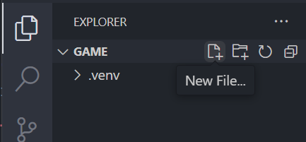
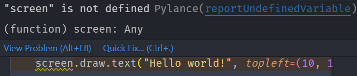

# Section 0 (Hello world)

## About

In this section we are going to draw some text in a window. The text "Hello world!" has been used by programmers forever to test that things are working as it should.

## Create a new file

That is easiest done through the file tab witin VS Code.



Name the file `game.py`.

With game.py open, write the following.

```python
def draw():
    screen.draw.text("Hello world!", topleft=(10, 10))
```

Take it slow when writing code, it is important that new lines and spaces are kept exatly as written above. Take your time and don't stress.

## Run your program

In the terminal write the following.

```shell
W:\game>pgzrun game.py
```

This should open a new window with the text "Hello world!" written. If this doesn't happen, make sure that the code is written the same as above.

<div style="background:#ff8; color:#000; padding: 0.5em 1em; font-weight:bold;font-family:monospace;">
    <p>Test on your own:</p>
    <ul>
        <li>Try changing the text to something other than "Hello world!".</li>
        <li>Try changing where the text appears on the screen. Hint, look at topleft=(10, 10).</li>
    </ul>
    <p>To run the code again after your changes, just write <em>pgzrun game.py</em> again from the terminal.</p>
</div>

## Run the program from VS Code

In order to run the program from within VS Code, we need to add some more code.
When using the `pgzrun` command from the terminal it sets everything up for us, but the code is just a python file that doesn't know anything about `pgzero`, let's change that.

At the top of your code, write:

```python
import pgzrun

```

This means that we tell python that we want to use the `pgzrun` module.

At the end of your code, wirte:

```python
pgzrun.go()
```

This means that we call a method called `go` from the `pgzrun` module. The parantheses `()` tells the computer that you want to run the method.

Your complete code should now look like this:

```python
import pgzrun

def draw():
    screen.draw.text("Hello world!", topleft=(10, 10))

pgzrun.go()
```

Now, press `F5` on your keyboard to start the debugger. Select "**Python File** Debug the currently active Python file" in the list that appears.

## Fixing the warning

You have a warning in the code. It is marked with a squiggly line under the word `screen`. If you move your mouse over the warning it will give you a hint about what is potentially wrong.



Now this is just a warning. The reson for the warning is that VS Code doesn't know what screen is. The code is working though so this is just a warning. You can fix the warning by giving VS Code a hint about what `screen` is.

Write the following directly under `import pgzrun`:

```python
from pgzero.screen import Screen
screen: Screen
```

Now the warning should disapear and you should be able to trust that something might be off if you see these squiggly lines in the future.