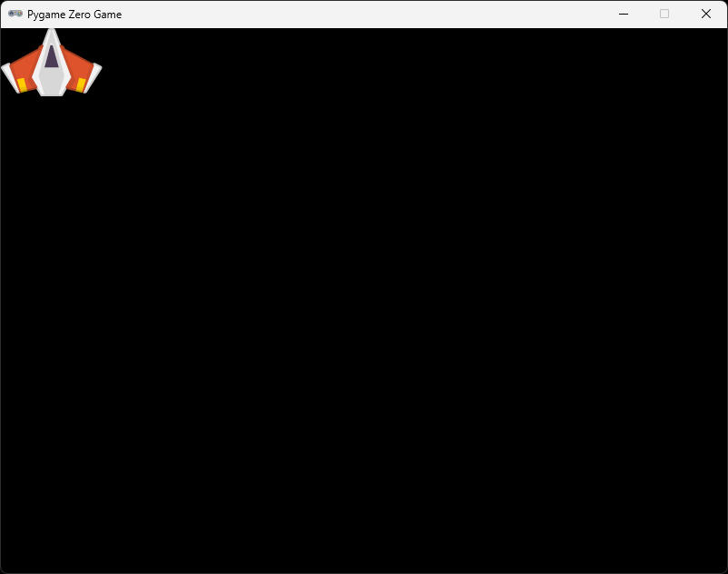

# Section 1 (Draw a spaceship)

## About

In this section we will create an Actor, load a spaceship image and draw that to the screen.

## Create images directory

In the root of your game directory create a sub-directory called `images`. This can be done from the terminal if you recall previously by the `md` command.

```shell
W:\game>md images
```

## Download spaceship image

The game we will make have images and assets from the free Kenny [Space Shooter Redux](https://kenney.nl/assets/space-shooter-redux), and [Space Shooter Extension](https://kenney.nl/assets/space-shooter-extension) asset packs.

* Download both of the asset packs and unpack them.
* Find a space-ship image that you want to use for your player
    * I've picked the image called `playerShip2_orange.png` that is located under `kenney_space-shooter-redux\PNG`, but you can pick any of the other player ships.
* Copy that image you have selected over to the `images` directory you created previously.
* Rename the image to `player`.

## Create an actor

In your `game.py` file, add the following directly under `import pgzrun`:

```python
from pgzero.builtins import Actor

player = Actor("player")
```

This means that we want to import `Actor` from `pgzero.builtins`.

On the next line we create a new variable that we call player and set that to be instansiated as an `Actor` that uses the `player` image. Since we named our images directory `images`, and our player image `player`, pgzero is able to locate our image.

## Draw the actor

Next, let's replace our "Hello world!", and line drawing with the following:

```python
    player.draw()
```


▶️ **Run the program and see that it works (press `F5`)**, you should have a result looking like this:



### ✏️ Try on your own

> 📋 Test other versions of the ships from the asset packs. Remember to copy the files over to your images directory. Also you need to have the same name in your code as your file in the images folder but if you change both to be called "player2" for instance, it will work fine.

## Stuck?

If you get stuck, you can find the complete code here:
* [game.py](./game.py)

## Next

Next up, [Section 2 (Place and scale the spaceship)](../section2)