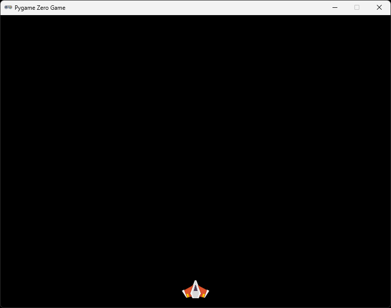

# Section 2 (Place the spaceship)

## About

This is a short section where we will change the size of the ship and place it at the bottom center of the screen. We will also download a helper library that extends the capabilities of the `Actor` class.

## Get the helper library

Create a new file called `pgzhelper.py`. If you don't remember how to make a new file, it is mentioned in [section0](/section0/).

Open [pgzhelper](https://raw.githubusercontent.com/QuirkyCort/pgzhelper/main/pgzhelper.py) in your web browser and select all code by pressing `ctrl`+`a` on your keyboard. Copy the text to the clipboard by pressing `ctrl`+`c`.

In VS Code, open `pgzhelper.py` and past the code you copied by pressing `ctrl`+`v`.

Open `game.py` and enter the following under the line `from pgzero.builtins import Actor`:

```python
from pgzhelper import *
```

This means that we want to use everything (`*`) from the `pgzhelper` module (file).

## Scale the player

I think that the ship is a little bit to big, I'd like to scale it by 50%. Directly under `player = Actor("player")`, add:
```python
player.scale = 0.5
```

This means that we scale the player by 0.5. As you know from math, 0.5 is the decimal representation of 50%. When programming we almost always use decimal to represent percentage.

Run the game and see that it works (press `F5`), your ship should be smaller.

## Place the player

We want to place the player at the bottom center of the screen and we want to be sure it is placed there even if we change the size of the window.

Therefore we need to place the size of the window in a variable. So over: `player = Actor("player")` let's define the size of the screen. We do that with a new type of variable called CONSTANT:

```python
WIDTH  = 800
HEIGHT = 600
```

When pgzero starts, it will se if these constants are defined otherwise it will default to 800×600.

So if we want to place the player at half the with, we can simply say `WIDTH / 2`. For the vertical `y` axis we want to place the player at the bottom, which is simply `HEIGHT`.

Let's see how that looks:

```python
player.x = WIDTH / 2
player.y = HEIGHT
```

Run the game and see that it works (press `F5`).

The spaceship appears to be a bit to far down now.


Let's think about this. How can we fix this? We need to move it up. Try subtracting some number from the `HEIGHT`, maybe `100`.

```python
player.y = HEIGHT - 100
```
Run the game and see that it works (press F5).

Now, that's better. But what if we change the scale of the player? There is a better way of doing this. The reason why half the player is showing in the fist place, is because the local origin `(0, 0)` of the player is at the center of the image. So to push the player up we need to move it up with half the height of the player. We can get the height of the player from the height property (`player.height`). Then we just need to devide it by 2 to get half of the height:

```python
player.y = HEIGHT - player.height / 2
```

Run the game and see that it works (press `F5`).

I'd like to get it a bit more up still though, so we can skip the `/ 2`, but now you know what it all means.

So the final thing should look like this:

```python
player = Actor("player")
player.scale = 0.5
player.x = WIDTH / 2
player.y = HEIGHT - player.height
```

## Structure with functions

We can use functions to re-use or structure our code. We already use a function in our code named `draw`, though this is a special function that pgzero calles 60 times per second to draw things to the screen. But we can make our own functions also. Let's move the code we have to scale and place the player into a new function. Let's name that function `scale_and_place_player`. 

Add new new lines after `player = Actor("player")`. On the new row, type `def scale_and_place_player():` and hit enter. The things you want to move into the function need to be indented with four spaces (` `). Let's do that with the code where set the player scale, x and y.

It should now look something like this:
```python
player = Actor("player")

def scale_and_place_player():
    player.scale = 0.5
    player.x = WIDTH / 2
    player.y = HEIGHT - player.height

def draw():
    player.draw()
```

If you run the game now, your player will end up in the top left corner again. That is because we haven't yet called our function. The reason `draw` works is because it is binging called automatically by `pgzero`.

To fix this we need to add a line at the end of our code, just before `pgzrun.go()`:

```python
scale_and_place_player()
pgzrun.go()
```

Run the program and see that it works (press `F5`), you should have a result looking like this:



<div style="background:#ff8; margin-bottom: 1em; color:#000; padding: 0.5em 1em; font-weight:bold;font-family:monospace;">
    <p>Test on your own:</p>
    <ul>
        <li>Don't be scared to test things, can you rotate the player?</li>
    </ul>
</div>

If you get stuck, you can find the complete code here:
* [game.py](./game.py)

## Next

Next up, [Section 3 (Move the player)](../section3)
