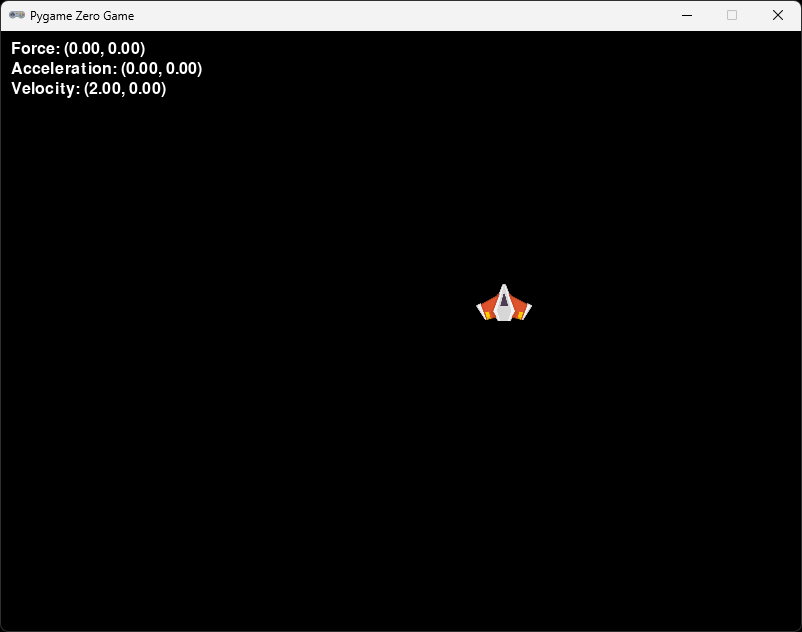

# Section 4 (Player physics)

## About

The way we move the player currently with our keyboard doesn't feel that good. When making games, player control is one of the key elements in making a fun game. In this section we will improve the player movement to feel better using some simple physics simulation.

## Game 🏋️ physics

Let’s delve into the fascinating world of 2D game physics. In video games, physics engines simulate the behavior of objects, ensuring that they move, collide, and interact somewhat realistically within the game environment. The key here is not to be acurate but more to be fun. In the original Super Mario Bros., Mario’s jump physics involve a constant downward acceleration due to gravity. Players can control jump height by holding the button longer, and precise timing is essential for navigating obstacles and reaching platforms 🍄🌟. Note that the key here is gameplay and not a accurate physics simulation.

## 2D Vectors

In game programming, a 2D vector represents a point or direction in a two-dimensional space. It consists of two components: an x-coordinate (horizontal) and a y-coordinate (vertical). Think of it as an arrow pointing from the origin (0,0) to a specific location. Vectors are essential for tasks like movement, collision detection, and rendering graphics. We are already using a vectors in our code, the position of the `Actor` (our player) is a Vector, for instance. That is how we can set it's position using `x =` and `y =`.

Let us add some more vectors, first we need to import the `Vector2` class from `pygame`. Under `from pgzero.builtins import Actor, keyboard` at the top of your code add:

```python
from pygame import Vector2
```

It is called `Vector2` because it is a 2D vector. Pygame also contains a 3D vector called... drum roll... `Vector3` but we are making a 2D game, so we use the 2D vector.

We will need to keep track of the player's acceleration, velocity and force. Add the following lines under `player = Actor("player")`:

```python
player_acceleration = Vector2(0, 0)
player_velocity = Vector2(0, 0)
player_force = Vector2(0, 0)
```

Now this will only create the vectors, but we need to use them. Let's start by adding a force to the player when we press `W` on the keyboard. Chage the `update` function to look like this:

```python
def update():
    if keyboard.a:
        player_force.x -= 1
    if keyboard.d:
        player_force.x += 1

    if player.left < 0:
        player.left = 0
    if player.right > WIDTH:
        player.right = WIDTH
```

Remove the `player.x -= 1` and `player.x += 1` lines, we will not use them anymore. We will use the force to calculate the acceleration instead of setting the position directly.

Now if you would start the game, it will not move the player anymore. This is because we need to calculate the acceleration and velocity based on the force. In order to do that we need to see what our old friend Isaac Newton has to say about this.

## Newtons second law of motion 🍎

Newton's Second Law of Motion states that when a force acts on an object, it will cause the object to accelerate. The larger the mass of the object, the greater the force will need to be to cause it to accelerate. This Law may be written as force equals mass times acceleration or:

`F = m × a`

We can use this formula to calculate the acceleration instead of the force by deviding both sides of the `=` sign with mass, giving us acceleration equals force devided by mass or:

`a = F / m`

Whit this in mind we can calculate the acceleration based on the force and the mass of the player. Add the following lines under where we set the `player_force` based on the keyboard input:

```python
    if keyboard.d:
        player_force.x += 1

    player_acceleration += player_force / player_mass
    player_velocity += player_acceleration
    player.pos += player_velocity

    if player.left < 0:
        player.left = 0
```

Your code will still not run. We are missing the mass of the player. Add the following line under where we set the `player_force = Vector2(0, 0)` a bit further up in the code:

```python
player_mass = 1
```

There is one more thing we need to do before the game can run. At the top of the `update` function, we need to tell the computer that we want to change the value of the global variables `player_acceleration`, `player_velocity`, `player_force` and `player_mass`. We do this by adding the following line at the top of the `update` function:

```python
def update():
    global player_force, player_acceleration, player_velocity
```

▶️ **Run the game and see that it works (press `F5`)**, you should be able to move the player to the left and right by pressing `A` and `D` on your keyboard. 

There is a problem though, the player will not stop moving when you release the `A` or `D` key. This is because we are not setting the force to zero when we release the key. We can do this by adding the following lines under the `if keyboard.d:` line:

```python
    if keyboard.a:
        player_force.x -= 1
    if keyboard.d:
        player_force.x += 1
    if not keyboard.a and not keyboard.d:
        player_force = Vector2(0, 0)
```

▶️ **Run the game and see that it works (press `F5`)**, you should be able to move the player to the left and right by pressing `A` and `D` on your keyboard. But our changes didn't really help.

We also need to set the acceleration to zero at the end of each frame. Add the following line at the end of the `update` function:

```python
    if player.right > WIDTH:
        player.right = WIDTH

    player_acceleration = Vector2(0, 0)
```

▶️ **Run the game and see that it works (press `F5`)**, you should be able to move the player to the left and right by pressing `A` and `D` on your keyboard. Things should have improved but still not great.

Another thing we need to do is to slow down the player a little each frame. A simple way of doing that is to multiply the velocity with a number less than 1. Add the following line at the end of the `update` function:

```python
    player_acceleration = Vector2(0, 0)
    player_velocity *= 0.92
```

▶️ **Run the game and see that it works (press `F5`)**, the player should now stop moving when you release the key, try tapping the key to see that the player moves a little each time you press.

Now the player moves a little bit to fast for my taste, let's set a max speed the player can move. Add the following lines at the end of the `update` function, just before where we set the `player.pos`:

```python
    if player_velocity.magnitude() > 0:
        player_velocity.clamp_magnitude_ip(0, MAX_VELOCITY)    

    player.pos += player_velocity
```

The magnitude is the length of a vector, you can think of it as the distance from the start to the end of the vector. It is actually based on the [Pythagorean theorem](https://en.wikipedia.org/wiki/Pythagorean_theorem) which you might know from school. `a² + b² = c²`, where `a` and `b` are the x and y components of the vector and `c` is the magnitude. So, `x² + y² = magnitude²` which leads to `magnitude = √(x² + y²)`. 

The `clamp_magnitude_ip` function will limit the magnitude of the vector to be between 0 and `MAX_VELOCITY`.

Add a definition of `MAX_VELOCITY` at the top of your code, just under where you defined `WIDTH` and `HEIGHT`:

```python
MAX_VELOCITY = 5
```

▶️ **Run the game and see that it works (press `F5`)**, the player should not move faster than 5 pixels per frame.

### ✏️ Try on your own

> 📋 Can you change the how quickly the player moves? Try changing the `player_mass = 1` and see how that affects the player movement.

We can also limit the force that is pushing the player. Add the following lines at the end of the `update` function, just before where we set the `player_acceleration`:

```python
    if player_force.magnitude() > 0:
        player_force.clamp_magnitude_ip(0, MAX_FORCE)
    
    player_acceleration += player_force / player_mass
```

Add a definition of `MAX_FORCE` at the top of your code, just over where you defined `MAX_VELOCITY`:

```python
MAX_FORCE = 3
```

▶️ **Run the game and see that it works (press `F5`)**, the player should not move faster than 5 pixels per frame and the force should not be more than 3.

Now it's time to add controls for moving the player up and down. Change the keyboard control un the `update` function to look like this:

```python
    if keyboard.a:
        player_force.x -= 1
    if keyboard.d:
        player_force.x += 1
    if keyboard.w:
        player_force.y -= 1
    if keyboard.s:
        player_force.y += 1
    if not keyboard.a and not keyboard.d and not keyboard.w and not keyboard.s:
        player_force = Vector2(0, 0)
```

We also need to update so that the player doesn't go outside the top and bottom of the screen. We also want to cancel the velocity of the player if it hits an edge. Change the code we have to limit the player to the sides of the screen to also limit the player to the top and bottom of the screen:

```python
    if player.left < 0:
        player.left = 0
        player_velocity.x = 0
    if player.right > WIDTH:
        player.right = WIDTH
        player_velocity.x = 0
    if player.bottom > HEIGHT:
        player.bottom = HEIGHT
        player_velocity.y = 0
    if player.top < 0:
        player.top = 0
        player_velocity.y = 0
```

▶️ **Run the game and see that it works (press `F5`)**, the player should not move outside the window.

One last thing we can do, it is not obvious but mulitiplying a number over and over by 0.92 will make it small quickly but it will never be zero. We can add a check to set the velocity to zero if it is very small. Add the following lines at the end of the `update` function, just after where we set the `player_velocity`:

```python
    player_velocity *= 0.92
    if player_velocity.magnitude() < 0.1:
        player_velocity = Vector2(0, 0)
```

▶️ **Run the game and see that it works (press `F5`)**, you should not see a difference, but the player will come to a full stop instead of just going really slow.

## Debugging
    
When you are working with physics, it can be hard to see what is going on. You can add some debug information to the screen to help you see what is going on. Add the following lines at the end of the `draw` function:

```python
    screen.draw.text("Force: ({0}, {1})".format(player_force.x, player_force.y), topleft=(10, 10))
    screen.draw.text("Acceleration: ({0}, {1})".format(player_acceleration.x, player_acceleration.y), topleft=(10, 30))
    screen.draw.text("Velocity: ({0}, {1})".format(player_velocity.x, player_velocity.y), topleft=(10, 50))
```

▶️ **Run the game and see that it works (press `F5`)**, you should see the force, acceleration and velocity of the player on the screen.

Now, we see the force and velocity changing, but not the acceleration. This is because the acceleration is set to zero at the end of the `update` function. To fix this, we need to store the acceleration in a variable that we only use for debugging. Duplicate the `player_acceleration` definition at the top of your code and name it `player_debug_acceleration`.

```python
player_acceleration = Vector2(0, 0)
player_debug_acceleration = Vector2(0, 0)
```

Just before you set the acceleration to zero at the end of the `update` function, add the following line:

```python
    player_debug_acceleration = player_acceleration
```

Change the `draw` function to show the `player_debug_acceleration` instead of the `player_acceleration`:

```python
    screen.draw.text("Acceleration: ({0}, {1})".format(player_debug_acceleration.x, player_debug_acceleration.y), topleft=(10, 30))
```

Change the `update` function to add the player_debug_acceleration to the global variables at the top of the function:

```python
    global player_force, player_acceleration, player_velocity, player_debug_acceleration
```

▶️ **Run the game and see that it works (press `F5`)**, you should see the acceleration of the player on the screen.

## Simplify

We can use a function print the vectors to the screen. Add the following function at the end of your code:

```python
def print_vector(text: str, vec: Vector2, left: int, top: int):
    screen.draw.text("{0}: ({1:.2f}, {2:.2f})".format(text, vec.x, vec.y), topleft=(left, top))
```

We can now call that function to print the vectors to the screen. Change the `draw` function to look like this:

```python
def draw():
    screen.clear()
    player.draw()

    print_vector("Force", player_force, 10, 10)
    print_vector("Acceleration", player_debug_acceleration, 10, 30)
    print_vector("Velocity", player_velocity, 10, 50)
```

▶️ **Run the game and see that it works (press `F5`)**, you should see the force, acceleration and velocity of the player on the screen. Your window should look something like this:



### ✏️ Try on your own

> 📋 Play around with player_mass, MAX_VELOCITY, MAX_FORCE and the 0.92 value until your player moves in a way that feels nice for you. Ask someone to test how it feels, can you make changes based on their feedback?

## Stuck?

If you get stuck, you can find the complete code here:
* [game.py](./game.py)

## Next

Next up, [Section 5 (Making a player class)](../section5)