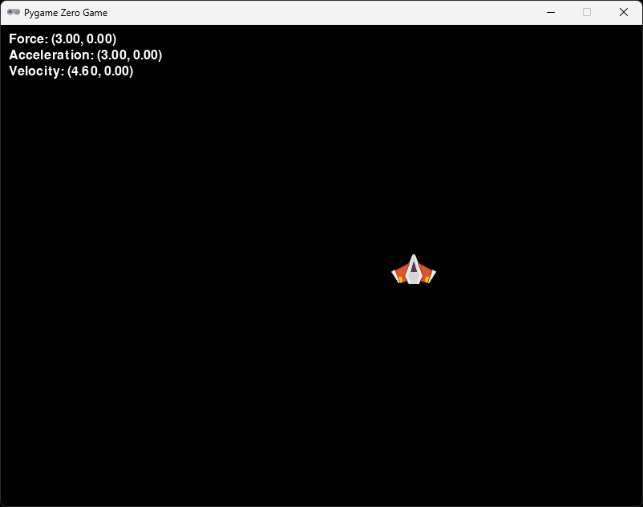

# Section 5 (Making a player class)

## About

In this section we are going to create a Player class. We do this to encapsulate the player logic and make it easier to manage the player in the game. Also the game file will be easier to read and understand. Before we start, take a note of the `player_mass`, `MAX_VELOCITY` and `MAX_FORCE` variables you changed in the previous section since we will move a lot of code around in this section and it would be sad if your values got lost.

## Create a player.py file

Create a new file called `player.py`. If you don't remember how to make a new file, it is mentioned in [section0](/section0/).

## Create a Player class

In `player.py`, add the following:

```python
class Player:
    def __init__(self):
        pass

    def update(self):
        pass

    def draw(self):
        pass
```

This means that we have created a class called `Player`. The class has three methods, `__init__`, `draw` and `update`. The `__init__` method is called when we create a new instance of the class. The `draw` method is called when we want to draw the player to the screen. The `update` method is called when we want to update the player.

We have added `pass` to all the methods, which means that we don't want to do anything here yet. We will soon replace it with some code though.

## Import the Player class

In `game.py`, add the following above the line `from pgzero.screen import Screen` at the top of the document:

```python
from player import Player
```

## Use the Player class

In `game.py`, replace the `player` variable with the following:

```python
player = Player()
```

In the update function, add the following to the top of the function:

```python
def update():
    player.update()
```

In the draw function, add the following to the top of the function:

```python
def draw():
    screen.clear()
    player.draw()
```

▶️ **Run the game and see that it works (press `F5`)**, it should let you run because of errors

Let's fix that. We need to move all code that has to do with the player to the player class. Let's start with the player actor, scale and the positioning of the player.

Move the the folling from `game.py` to the __init__ method in the Player class using `ctrl` + `x` and `ctrl` + `v`:

```python
player_acceleration = Vector2(0, 0)
player_debug_acceleration = Vector2(0, 0)
player_velocity = Vector2(0, 0)
player_force = Vector2(0, 0)
player_mass = 1
```

Like so:

```python
class Player:
    def __init__(self):
        player_acceleration = Vector2(0, 0)
        player_debug_acceleration = Vector2(0, 0)
        player_velocity = Vector2(0, 0)
        player_force = Vector2(0, 0)
        player_mass = 1
```

Change the `player_` to `self.` in the Player class. This is because we are now inside the class and need to reference the variables with `self.`.

```python
class Player:
    def __init__(self):
        self.acceleration = Vector2(0, 0)
        self.debug_acceleration = Vector2(0, 0)
        self.velocity = Vector2(0, 0)
        self.force = Vector2(0, 0)
        self.mass = 1

    ...
```

Import `Vector2` from `pygame` at the top of the `player.py` file:

```python
from pygame import Vector2
```

At the top of the `__init__` method we need to add the actor back in. We also need to set the image of the actor to the player image. We can do this by adding the following:

```python
class Player:
    def __init__(self):
        self.actor = Actor("player")
        ...
```

Remember to import `Actor` from `pgzero.builtins` at the top of the `player.py`.

```python
from pgzero.builtins import Actor
```

Let's also move the content of the `scale_and_place_player` function to the `__init__` method in the Player class. Remember to change the `player.` to `self.actor`. Delete the `scale_and_place_player` function from the `game.py` file.

```python
class Player:
    def __init__(self):
        self.actor = Actor("player")
        self.actor.scale = 0.5
        self.actor.x = WIDTH / 2
        self.actor.y = HEIGHT - self.actor.height
        ...
```

Now we get a warning about that `WIDTH` and `HEIGHT` is not defined. We need to pass these to the Player class. We can do this by adding them as arguments to the `__init__` method. Let's also change the names to `window_width` and `window_height` to make it more clear.

```python
class Player:
    def __init__(self, window_width: int, window_height: int):
        self.actor = Actor("player")
        self.actor.scale = 0.5
        self.actor.x = window_width / 2
        self.actor.y = window_height - self.actor.height
        self.window_width = window_width
        self.window_height = window_height
```

In `game.py`, we need to pass the `WIDTH` and `HEIGHT` to the Player class. We can do this by changing the `player = Player()` to `player = Player(WIDTH, HEIGHT)`.

We can remove the line with the `global` keyword from the `update` function in the `game.py` file. We don't need it anymore.

Next, move the keyboard logic from `game.py` to the `draw` method in the Player class, let's also make a new method called `handle_input` that we can call from the `update` method. Again, remember to change the `player_force.` to `self.force`.:

```python
    def handle_input(self):
        if keyboard.a:
            self.force.x -= 1
        if keyboard.d:
            self.force.x += 1
        if keyboard.w:
            self.force.y -= 1
        if keyboard.s:
            self.force.y += 1
        if not keyboard.a and not keyboard.d and not keyboard.w and not keyboard.s:
            self.force = Vector2(0, 0)

    def update(self):
        self.handle_input()
```

Let's also move the physics logic from `game.py` to the Player class. Let's make a new method also for that called `update_physics`. Remember to change the `player_` to `self.`, and `player.` to `self.actor`.

```python
    def update_physics(self):
        if self.force.magnitude() > 0:
            self.force.clamp_magnitude_ip(0, MAX_FORCE)

        self.acceleration += self.force / self.mass
        self.velocity += self.acceleration

        if self.velocity.magnitude() > 0:
            self.velocity.clamp_magnitude_ip(0, MAX_VELOCITY)

        self.actor.pos += self.velocity

        if self.actor.left < 0:
            self.actor.left = 0
            self.velocity.x = 0
        if self.actor.right > WIDTH:
            self.actor.right = WIDTH
            self.velocity.x = 0
        if self.actor.bottom > HEIGHT:
            self.actor.bottom = HEIGHT
            self.velocity.y = 0
        if self.actor.top < 0:
            self.actor.top = 0
            self.velocity.y = 0

        self.debug_acceleration = self.acceleration
        self.acceleration = Vector2(0, 0)
        self.velocity *= 0.92
        if self.velocity.magnitude() < 0.1:
            self.velocity = Vector2(0, 0)
```

We need to declare `MAX_FORCE` and `MAX_VELOCITY` at the top of the `player.py` file. Let's set them to 3 and 5.

```python
MAX_VELOCITY = 5
MAX_FORCE = 3
```

We also need to change `WIDTH` and `HEIGHT` to `self.window_width` and `self.window_height`.

```python
        if self.actor.right > self.window_width:
            self.actor.right = self.window_width
            self.velocity.x = 0
        if self.actor.bottom > self.window_height:
            self.actor.bottom = self.window_height
            self.velocity.y = 0
```

Finally, let's call the `update_physics` method from the `update` method in the Player class.

```python
    def update(self):
        self.handle_input()
        self.update_physics()
```

If you have done everything correctly, you should have a `game.py` file that looks like this:

```python
import pgzrun
from pgzero.builtins import Actor, keyboard
from pygame import Vector2

from pgzhelper import *
from player import Player
from pgzero.screen import Screen
screen: Screen

WIDTH  = 800
HEIGHT = 600

MAX_VELOCITY = 5
MAX_FORCE = 3

player = Player(WIDTH, HEIGHT)

def update():
    player.update()

def draw():
    screen.clear()
    player.draw()
    
    print_vector("Force", player_force, 10, 10)
    print_vector("Acceleration", player_debug_acceleration, 10, 30)
    print_vector("Velocity", player_velocity, 10, 50)

def print_vector(text: str, vec: Vector2, left: int, top: int):
    screen.draw.text("{0}: ({1:.2f}, {2:.2f})".format(text, vec.x, vec.y), topleft=(left, top))

pgzrun.go()
```

Let's move the `print_vector` function in to the `player.py` file. Remember to change the `player_` to `self.`.

```python
class Player:
    def __init__(self, window_width: int, window_height: int):
        ...

    def print_vector(self, text: str, vec: Vector2, left: int, top: int):
        screen.draw.text("{0}: ({1:.2f}, {2:.2f})".format(text, vec.x, vec.y), topleft=(left, top))
```

We need to get access to `screen`, we can pass that to the draw method and forward it to the `print_vector` method, for now let's just add it to `print_vector`. We also need to import it from `pgzero.screen`.

```python
...

from pgzero.screen import Screen

...

class Player:
    def __init__(self, window_width: int, window_height: int):
        ...

    def print_vector(self, screen: Screen, text: str, vec: Vector2, left: int, top: int):
        screen.draw.text("{0}: ({1:.2f}, {2:.2f})".format(text, vec.x, vec.y), topleft=(left, top))

    ...
```

Now let's draw the player actor. Let's add the following to the `draw` method of the Player class:

```python
class Player:
    def __init__(self, window_width: int, window_height: int):
        ...

    def draw(self):
        self.actor.draw()
```

We can also add an optional debug parameter to the `draw` method. This will allow us to draw the debug information if we want to. Also remeber add the screen argument to the draw method. Let's add the following to the `draw` method of the Player class:

```python
class Player:
    def __init__(self, window_width: int, window_height: int):
        ...

    def draw(self, screen: Screen, debug: bool = False):
        self.actor.draw()
        if debug:
            self.print_vector(screen, "Force", self.force, 10, 10)
            self.print_vector(screen, "Acceleration", self.debug_acceleration, 10, 30)
            self.print_vector(screen, "Velocity", self.velocity, 10, 50)
```

In `game.py`, clean up any leftover code and imports. When you're done you should only have the following left:

```python
import pgzrun

from player import Player
from pgzero.screen import Screen
screen: Screen

WIDTH  = 800
HEIGHT = 600

player = Player(WIDTH, HEIGHT)

def update():
    player.update()

def draw():
    screen.clear()
    player.draw(screen, True)

pgzrun.go()
```
Note that we pass in the `screen` to the `draw` method of the player. We also pass `True` to debug meaning that we want to print the debug information. This can be changed at anytime to `False`, if you want to hide it. 

Finally, we should be able to run the game.

▶️ **Run the game and see that it works (press `F5`)**. Something is off though, the player is to big. But we scale it in the `__init__` method of the Player class.

The problem is that we are not importing our helper from [section2](../section2) in the Player class. Let's add that to the top of the `player.py` file:

```python
from pgzhelper import *
```

Now we have a clean `game.py` and `player.py` file. It will be easier to manage new things we want to add to the game and player in the coming sections.

▶️ **Run the game and see that it works (press `F5`)**. You should have a result looking like this:



### ✏️ Try on your own

> 📋 Hide the debug information only by changing `game.py`.

> 📋 Can you move the logic of where we set the actor position and limit movement to the screen size it's own method in the Player class, call the method `position_player`?


## Stuck?

If you get stuck, you can find the complete code here:
* [game.py](./game.py)
* [player.py](./player.py)

## Next

Next up, [Section 6 (Adding thrusters to the ship)](../section6)