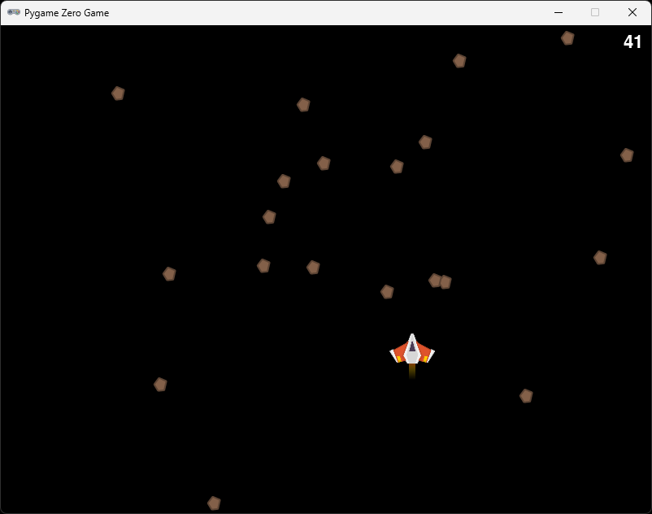

# Section 7 (Asteroids) 

## About

In this section we are going to make the first challenge of the game, an asteroid field. We will create a Class for the asteroid field, make the asteroids move and draw them to the screen. The player will get points when an asteroid have passed the screen.

## Create an asteroid class

Create a new file called `asteriod_field.py` in the same directory as your `game.py` file. In `asteriod_field.py` write the following:

```python
class AsteroidField:
    def __init__(self, world_width: int, world_height: int):
        self.world_width = world_width
        self.world_height = world_height
        pass

    def update(self) -> int:
        pass

    def draw(self):
        pass
```

## Add a list of asteroids

We need to add a variable that can hold a list of asteriods. The type of variable we are going to use is called a list in python. Add the following to the `__init__` method of your `asteriod_field.py` file:

```python
    def __init__(self, world_width: int, world_height: int):
        self.asteroids: List[Actor] = []
```

In order to use the `List` type, we need to import it, we also need to import the `Actor` again. Add the following to the top of your `asteriod_field.py` file:

```python
from typing import List
from pgzero.builtins import Actor
```

Still in the `__init__` method, let's populate the list of asteroids with some random asteroids, we add the asteriods to the asteriods list using the `append` method that comes with the List class. 

Add the following to the `__init__` method:

```python
        for _ in range(self.AMOUNT):
            asteroid = Actor("asteroid1")
            asteroid.pos = randint(0, world_width), -randint(0, world_height)
            self.asteroids.append(asteroid)
```

`randint` is a function that comes with the `random` module, we will import it soon. The `randint` function takes two arguments, the first is the lower bound and the second is the upper bound. The function will return a random number between the two bounds.

We also need to add the `AMOUNT` variable to the class. Add the following to the class:

```python
class AsteroidField:
    AMOUNT = 20
    
    ...
```

...and import the `randint` function by adding the following to the top of the file:

```python
from random import randint
```

## Draw the asteroids

In the `draw` method of the `AsteroidField` class, add the following, using a for loop.

```python
    def draw(self):
        for asteroid in self.asteroids:
            asteroid.draw()
```

## Add the AsteroidField in the game

In your `game.py` file, import the `AsteroidField` class by adding the following to the top of the file:

```python
from asteroid_field import AsteroidField
```

Under the `player = Player(WIDTH, HEIGHT)` line, add the following to create an instance of the `AsteroidField` class:

```python
asteroid_field = AsteroidField(WIDTH, HEIGHT)
```

And finally draw the asteroid field by adding the following to the `draw` function:

```python
def draw():
    screen.clear()
    asteroid_field.draw()
    player.draw(screen, False)
```

Note that I've added a `False` to the `player.draw` call. This is because I feel that the debug information is not needed for the player, but you can keep it if you want.

▶️ **Run the game and see that it works (press `F5)**, you should see a bunch of asteriods on the screen under the player.

## Move the asteroids

In the `update` method of the `AsteroidField` class, add the following:

```python
    def update(self):
        for asteroid in self.asteroids:
            asteroid.y += 2
        
            if asteroid.top > self.world_height:
                asteroid.pos = randint(0, self.world_width), 0
```

There are two things happening here. First we are moving the asteroids down the screen by adding 2 to the `y` property of the `Actor`. We are also checking if the asteroid has passed the bottom of the screen, if it has we are placing it at the top of the screen again by setting the pos `Vector` to a random value between 0 and world width for the x component and 0 for the y component.

We need to call the asteriod fileds `update` method from the game. In `game.py`, add the following to the `update` function:

```python
def update():
    asteroid_field.update()
    player.update()
```

▶️ **Run the game and see that it works (press `F5`)**, you should see the asteroids moving down the screen and when they pass the bottom of the screen they should be placed at the top of the screen again.

Let's also move the asteriods up when we create them, so that no asteriods are showing when we start the game. We can easily do that by updating the position of the asteriod in the `__init__` method of the `AsteroidField` class. Just set a minus sign to the y component of the asteriod position like so:

```python
    def __init__(self, world_width: int, world_height: int):
        ...
        for _ in range(self.AMOUNT):
            asteroid.pos = randint(0, world_width), -randint(0, world_height)
```

▶️ **Run the game and see that it works (press `F5`)**, you should see that no asteriods are showing when you start the game but they should appear from the top of the screen one at a time.

## Add points

Let's make it so that the player gets points when an asteriod passes the screen. We can do this by adding a variable to `game.py` that holds the points and pass it in to the `update` method of the asteriods.

In `game.py`, add the following variable at the top of the file:

```python
points = 0
```

Then pass it in to the `update` method of the `AsteroidField` class by adding it as an argument to the method:

```python
    def update(self, points: int):
```

In the `update` method of the `AsteroidField` class, add the following to check if the asteriod has passed the screen and if it has, add a point to the points variable:

```python
    def update(self, points: int):
        for asteroid in self.asteroids:
            asteroid.y += 2
        
            if asteroid.top > self.world_height:
                asteroid.pos = randint(0, self.world_width), 0
                points += 1
```

Pass the points variable in to the `update` method of the `AsteroidField` class in the `update` function of `game.py`:

```python
def update():
    asteroid_field.update(points)
    player.update()
```

Finally, let's draw the points to the screen. Add the following to the `draw` function of `game.py`:

```python
def draw():
    ...

    screen.draw.text(str(points), topright=(WIDTH - 10, 10), fontsize=32)
```

▶️ **Run the game and see that it works (press `F5`)**, you should see a 0 at the top right corner of the screen, but it's not updating.

The reason the points are not updating is because we are passing the points variable to the `update` method of the `AsteroidField` class, but we are not returning it. We need to return the points variable from the `update` method of the `AsteroidField` class. Add the following to the `update` method of the `AsteroidField` class:

```python
    def update(self, points: int) -> int:
        ...
        return points
```
...and update the `update` function in `game.py` to use the returned value:

```python
def update():
    global points
    points = asteroid_field.update(points)
    player.update()
```

▶️ **Run the game and see that it works (press `F5`)**, you should see the points updating when an asteriod passes the screen.

## Add a game over

Let's add a game over when an asteriod hits the player. We can do this by checking if the player has collided with an asteriod in the `update` method of the `game.py` file.

Add the following to the `update` method of the `game.py` file:

```python
def update():
    global points
    points = asteroid_field.update(points)
    player.update()

    for asteroid in asteroid_field.asteroids:
        if player.actor.colliderect(asteroid):
            print("Game over")
            print(f"Points: {points}")
            exit()
```

▶️ **Run the game and see that it works (press `F5`)**, you should see "Game over" in the terminal when an asteriod hits the player.

Let's move this logic into the asteriod field, also we can use a circular collision detection instead of a rectangular, it will feel more fair. 

Add the following to the `AsteroidField` class:

```python
    def check_collision(self, actor: Actor) -> bool:
        for asteroid in self.asteroids:
            if asteroid.circle_collidecircle(actor):
                return True

        return False
```

`circle_collidescircle` is part of the `pgzhelper` module, we need to import it. Add the following to the top of the `asteriod_field.py` file:

```python
from pgzhelper import *
```

In order to use circular collision detection, we need to set the radius of the actors.

In the `__init__` method of the `AsteroidField` class, add the following to set the radius of the asteriods:

```python
    def __init__(self, world_width: int, world_height: int):
        ...
        for _ in range(self.AMOUNT):
            asteroid = Actor("asteroid")
            asteroid.radius = asteroid.width * 0.4
```

...and in the `__init__` method of the `Player` class, add the following to set the radius of the player:

```python
    def __init__(self, window_width: int, window_height: int):
        self.actor = Actor('player')
        self.actor.scale = 0.5
        self.actor.radius = self.actor.width * 0.3
        ...
```

We set the radius to 40% of the width of the asteriod since it is fairly round but 30% of the player since that covers ony the body of the ship. It fill feel more fair to the player if the collision is a bit smaller than the actual size of the ship.

Finally, let's use the `check_collision` method in the `game.py` file.

In the `game.py` file, under the `update` function, replace the for loop over the asteriods to just call check_collision on the asteriod field:

```python
def update():
    global points
    points = asteroid_field.update(points)
    player.update()

    if asteroid_field.check_collision(player.actor):
        print("Game over")
        print(f"Points: {points}")
        exit()
```

▶️ **Run the game and see that it works (press `F5`)**, you should see "Game over" along your total score in the terminal when an asteriod hits the player. 🥳 Congratulations! You have now finnished your first full game loop. You have a player, challenges, points, and game over. Your game should look something like this:



### ✏️ Try on your own

> 📋 Can you make an asteriod class, with a random speed to make it a bit more challenging

> 📋 Can you load different sizes of asteroids by using `Actor("asteroid" + str(randint(1, 4)))` and name the asteriod images asteroid1, asteroid2 etc?

## Stuck?

If you get stuck, you can find the complete code here:
* [game.py](./game.py)
* [player.py](./player.py)
* [asteroid_field.py](./asteroid_field.py)

## Next

Next up, [Section 8 (HUD)](../section8)