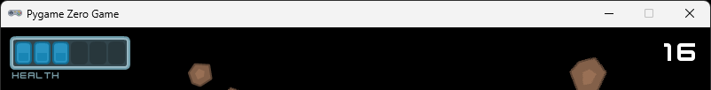

# Section 8 (HUD and health)

## About

In this section we will add a HUD (Heads Up Display) to the game. We will also add a health bar to the player.


## Download assets

Kenny has two great asset packs called [UI Pack](https://kenney.nl/assets/ui-pack) and [UI Pack (Space Expansion)](https://kenney.nl/assets/ui-pack-space-expansion) that we will use for the HUD. Download the asset packs and unpack it.

## Create a HUD module

Create a new file called `hud.py` in the root of your game directory. In `hud.py`, add the following:

```python
from typing import Any
from pgzero.screen import Screen

def draw_healtbar(
    screen: Screen,
    x: int,
    y: int,
):
    screen.blit("ui_glass_panel1", (x, y))

```

You will need an image called `ui_glass_panel1`. You can make using `glassPanel.png` from the UI Pack (Space Expansion) asset pack, by croping and resizing it to 136 x 38 piexels in your favorite image editor. If you want to save some time, I've created the image for you, you can download here: [ui_glass_panel1.png](./images/ui_glass_panel1.png).


Now let's call the new draw_healthbar function from the `draw` method in `game.py`:

```python
def draw():
    ...

    hud.draw_healtbar(screen, 10, 10)
    screen.draw.text(str(points), topright=(WIDTH - 10, 10), fontsize=32)
```

▶️ **Run the game and see that it works (press `F5`)**, you should have see the glass manel on the top left of your window.


Let's also move the point display to the `hud.py` file. Add the following to `hud.py`:

```python
def draw_score(
    screen: Screen,
    points: int,
    x: int,
    y: int,
):
    screen.draw.text(str(points), topright=(x, y), fontsize=32)
```

And call it from `game.py`:

```python
def draw():
    ...

    hud.draw_score(screen, points, WIDTH - 10, 10)
```

▶️ **Run the game and see that it works (press `F5`)**, you should have see the points displayed in the top right corner of your window.

Now I think that the font we use is a bit doll and not to space like. We have some fonts we can use from the asset pack. Copy the `kenvector_future.ttf` file from the UI Pack to your game directory under a new directory called `fonts`. Rename the file to `kenny.ttf`.

We can use the new font by passing it to the `draw.text` method. Add the following to `hud.py`:

```python
def draw_score(
    screen: Screen,
    points: int,
    x: int,
    y: int,
):
    screen.draw.text(str(points), topright=(x, y), fontsize=32, fontname="kenny")
```

▶️ **Run the game and see that it works (press `F5`)**, you should have see the points displayed in the top right corner of your window with the new font.


Now let's add some more graphics to the health bar. We will start by adding six blue squares to the health bar, one for each helth point. But first we need the image. Let's use the `squareBlue.png` from the UI Pack (Space Expansion) asset pack (located in `kenney_ui-pack-space-expansion\PNG`). Copy the image to your `images` directory and rename it to `ui_health.png`.


Add the following to `hud.py`:

```python
def draw_healthbar(
    screen: Screen,
    x: int,
    y: int,
    health: int,
):
    screen.blit("ui_glass_panel1", (x, y))
    screen.blit("ui_health", (x + 6, y + 6))
```

We add 6 to x and y to place it inside the glass panel.

▶️ **Run the game and see that it works (press `F5`)**, you should have see the health bar displayed in the top left corner of your window.


Let's add the rest of the health points. Add the following to `hud.py`:

```python
def draw_healthbar(
    screen: Screen,
    x: int,
    y: int,
    health: int,
):
    ...
    screen.blit("ui_health", (x + 6, y + 6))
    screen.blit("ui_health", (x + 27, y + 6))
    screen.blit("ui_health", (x + 48, y + 6))
    screen.blit("ui_health", (x + 69, y + 6))
    screen.blit("ui_health", (x + 90, y + 6))
    screen.blit("ui_health", (x + 111, y + 6))
```

We add 21 to x for each new square to push them to the right, I happen to know that the image is 19 pixels wide and I want 2 pixels spacing between the squares.

▶️ **Run the game and see that it works (press `F5`)**, you should have see the health bar with six blue indicators in the top left corner of your window.

Now there is a better way of doing this so that you don't need to do the math in your head. Let's have the computer calcualte this for us. Add the following to `hud.py`:

```python
def draw_healthbar(
    screen: Screen,
    x: int,
    y: int,
):
    ...
    for i in range(6):
        screen.blit("ui_health", (x + 6 + i * 21, y + 6))
```

▶️ **Run the game and see that it works (press `F5`)**, you should see the same, but now with less code which is almost always good.

Try chaning the number to 3 in the `range` function and see that you only get three blue squares.

This is how we will control how many bars you have left. Notice that it's not really clear how many poits are max, lets fix that by drawing a shadow under each square, even the once we are not showing. First we need the shadow image. Let's use the `square_shadow.png` from the UI Pack (Space Expansion) asset pack (located in `kenney_ui-pack-space-expansion\PNG`). Copy the image to your `images` directory and rename it to `ui_shadow.png`.

Add the following to `hud.py`:

```python
def draw_healthbar(
    screen: Screen,
    x: int,
    y: int,
):
    ...
    for i in range(3):
        screen.blit("ui_health", (x + 6 + i * 21, y + 6))
    for i in range(6):
        screen.blit("ui_shadow", (x + 6 + i * 21, y + 6))
```

▶️ **Run the game and see that it works (press `F5`)**, you should see the same, but now with shadows under each square.


Now that's better. But we need to be able to control how many health points we have. Let's add a parameter to the `draw_healthbar` function. Add the following to `hud.py`:

```python
def draw_healthbar(
    ...
    health: int,
):
    ...
    for i in range(health):
        screen.blit("ui_health", (x + 6 + i * 21, y + 6))
    ...
```

And pass it in from `game.py`, let's hard code it to 3 for now:

```python
def draw():
    ...
    hud.draw_healthbar(screen, 10, 10, 3)
    ...
```

▶️ **Run the game and see that it works (press `F5`)**, you should not see any difference, try changing the value 3 something else, it should change how many helth points you see.

It might be clear that this is health, but it would be nice if we indicate it with some text as well. Add the following to `hud.py`:

```python
def draw_healthbar(
    screen: Screen,
    x: int,
    y: int,
    health: int,
):
    ...

    screen.draw.text("health", (x + 2, y + 38), fontsize=11, fontname="kenny", color=(117, 151, 161))
```

This will draw the text "health" under the health bar with a smaller font and a blueish color matching the graphics.

▶️ **Run the game and see that it works (press `F5`)**, you should see the text "health" under the health bar.



### ✏️ Try on your own

> 📋 Can you add a glass panel under the score?

## Hook up the health bar to the player

Now we need to hook up the health bar to the player. We will start by adding a health property to the player. Add the following to `player.py`:

```python
class Player:
    def __init__(self, window_width: int, window_height: int):
        ...
        self.health = 6
```

Now we need to pass the health to the `draw_healthbar` function. Add the following to `game.py`:

```python
def draw():
    ...
    
    draw_healthbar(screen, 10, 10, player.health)
    ...
```

▶️ **Run the game and see that it works (press `F5`)**, you should see the health bar with six blue indicators in the top left corner of your window, indicating that you have full health.

Now we need to be able to take damage. Add the following to `player.py`:

```python
class Player:
    def __init__(self, window_width: int, window_height: int):
        ...
        self.health = 6

    def take_damage(self):
        self.health -= 1
```

And call it from `game.py` when the player collides with an asteroid:

```python
def update():
    ...

    if asteroid_field.check_collision(player.actor):
        player.take_damage()
```

▶️ **Run the game and see that it works (press `F5`)**, if you hit an asteroid, you should see the health bar decrease. But there is a problem, the health bar get's cleared directly even if you only hit one asteroid.

The reason this happens is that we keep hitting the asteroid every frame. We need to remove the asteroid when we hit it to avoid it from hitting the player the next frame.

In order to do that, we need to return the asteroid we hit from the `check_collision` method. Add the following to `asteroid_field.py`:

```python
class AsteroidField:
    ...
    def check_collision(self, actor: Actor) -> Optional[Asteroid]:
        for asteroid in self.asteroids:
            if asteroid.circle_collidecircle(actor):
                return asteroid

        return None
```

This means that if we hit an asteroid, we will return the asteroid we hit, otherwise we will return `None`.

We also need to add a new method to the asteroid field to remove an asteroid. Add the following to `asteroid_field.py`:

```python

class AsteroidField:
    ...
    def remove_asteroid(self, asteroid: Asteroid):
        self.asteroids.remove(asteroid)
    ...
```


In `game.py`, update the `update` function to remove the asteroid when we hit it:

```python
def update():
    ...

    asteroid = asteroid_field.check_collision(player.actor)
    if asteroid:
        player.take_damage()
        asteroid_field.remove_asteroid(asteroid)
```

▶️ **Run the game and see that it works (press `F5`)**, you should see the health bar decrease when you hit an asteroid.


### ✏️ Try on your own

> 📋 Can you add back the game over when player health reaches 0?

## Stuck?

If you get stuck, you can find the complete code here:

* [game.py](./game.py)
* [player.py](./player.py)
* [hud.py](./hud.py)
* [asteroid_field.py](./asteroid_field.py)

## Next

Next up, [Section 9 (Game over and restart)](../section9)
